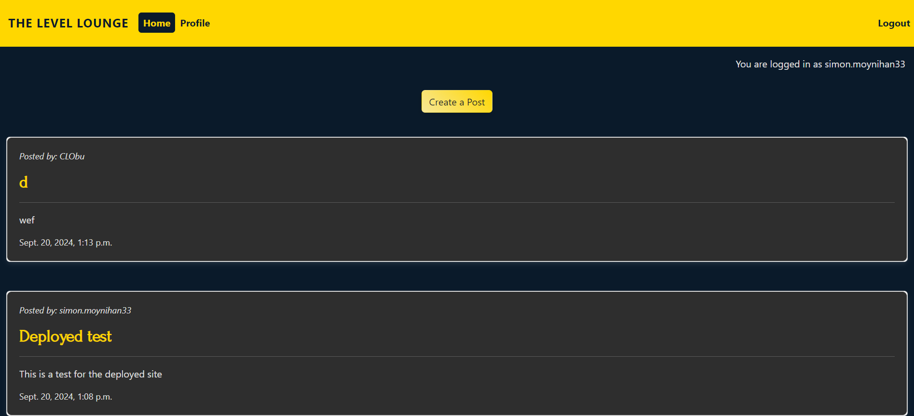

# The Level Lounge
The Level Lounge is a forum based app that allows users to engage in discourse around the topic of gaming. Users have the ability to post, comment, reply, save drafts, read other posts and engage in a community. 

[App Link](https://level-lounge-16ccb4ef258a.herokuapp.com/)

## Technologies Used

### **Development Environment & Version Control:**

- Git: Distributed version control system used for tracking changes in my code.
- GitHub: A platform for hosting my Git repositories and collaborating on code. Also used for version control, issue tracking, and project management.
- Code Institute IDE: Integrated Development Environment (IDE) used for writing and editing my code.
- Django: A high-level Python web framework that encourages rapid development and clean, pragmatic design.
- Python: The programming language used to develop the backend of my application.
- pip: Python’s package installer, used to install and manage packages.

### **Web Framework & Backend:**

- Django: Web framework used for building the backend of an application, including handling HTTP requests, routing, database management, templating and more.
- Django Allauth: Third-party package used for handling user authentication.
- PostgreSQL: Default database given to us by Code Institute.
- Django Debug Toolbar: A configurable set of panels that display various debug information about the current request/response.

### **Frontend Technologies**

- HTML/CSS: Markup and styling languages used for structuring and designing the user interface of your application.
- Bootstrap: A front-end framework that helps design responsive web pages and user interfaces.

### **API's and Documentation**

- Django Documentation: Used extensively throughout app as it is a well documented and clearly defined framework.

### **Cloud & Deployment**

- Heroku: A cloud platform used for deploying, managing, and scaling a web application.

### **Documentation & Planning**

- LucidChart: Used for creating ERD and Wireframes.

### **Testing**

-Autopep8: Used for python code validation.

### **Project Management**

- GitHub Projects: For managing tasks, user stories, and sprints in an Agile fashion.

### **Assistance & Supplementation**

- ChatGPT: AI-powered assistant for helping with debugging, planning and documenting my project.
- [Logo Design Ai](https://logodesign.ai/) to create the logo

## Credits

**Images**:
- [Hero:](https://www.pexels.com/photo/low-light-photo-of-nes-controller-1637436/) By Tomasz Filipek.