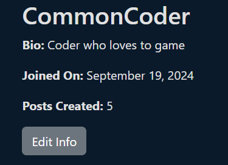

# The Level Lounge
Welcome to Level Lounge, a vibrant online community designed for gamers, creators, and enthusiasts alike! Our forum is more than just a place to chat about games; it's a dynamic space where you can connect, share, and collaborate with others who share your passion for gaming.

🎮 What is Level Lounge?

Level Lounge is an open forum where users can dive into a variety of topics, from casual gaming discussions to in-depth strategy debates and everything in between. Whether you’re here to chat about your favorite game, find teammates for your next raid, or discuss the latest trends in game development, Level Lounge has a place for you.

🗨️ Engage in Meaningful Conversations

We believe in the power of community. At Level Lounge, you can engage in both lighthearted and meaningful conversations about the gaming world. Our forum is designed to foster thoughtful discussions, share advice, and connect like-minded individuals. Whether you’re a seasoned pro or a newcomer, your voice matters here.

🤝 Collaborate and Create

Level Lounge isn’t just about conversation; it’s about creation. Connect with others to form parties, collaborate on game-related media, or even team up for game jams and other creative projects. Share your work, get feedback, and find fellow creators to help bring your visions to life.

🔐 Secure User Login

To keep our community safe and secure, Level Lounge features a robust user login system. Create your profile, customize your avatar, and start contributing to the community today.

🏆 Reputation and Recognition

Earn reputation points by contributing to discussions, helping others, and sharing your expertise. Climb the ranks, earn badges, and become a recognized member of the Level Lounge community!

🚀 Join the Conversation

Dive in, introduce yourself, and start exploring everything Level Lounge has to offer. Whether you're here to learn, collaborate, or just hang out, we’re excited to have you as part of our growing community. Let’s level up together!

[App Link](https://level-lounge-16ccb4ef258a.herokuapp.com/)

- [User Experience](#user-experience)
  - [User Stories](#user-stories)
  - [Site Goals](#site-goals)
- [Design](#design)
  - [Color Scheme](#color-scheme)
  - [Databse Schema](#fonts)
- [Planning](#planning)
  - [Wireframse](#wireframes)
  - [Entity Relationship Diagram](#erd)
  - [Agile Methodology](#agile-methodology)
    - [Milestones](#milestones)
    - [Epics](#epics)
    - [Issues](#issues)
    - [Labels](#labels)
    - [MoSCoW Prioritization](#MoScoW)
    - [Fibonacci Scale](#fibonacci-scale)
    - [Kanban Board](#kanban-board)
- [Features](#features)
  - [Navigation](#navigation)
    - [Login](#log-in)
    - [Logout](#log-out)
    - [Signup](#signup)
  - [Footer](#footer)
  - [Landing Page](#landing-page)
  - [Profile Page](#profile-page)
  - [Create Post](#create-post)
  - [Edit Post Page](#edit-post)
  - [Delete Post Modal](#delete-post-modal)
  - [Edit Profile Modal](#edit-profile-modal)
  - [Comments](#comments)
  - [Nested Replies](#nested-replies)
  - [Reply Button Dropdown](#reply-button-dropdown)
  - [Profile Image](#profile-image)
  - [Default Avatar](#default-avatar)
  - [User Drafts](#user-drafts)
  - [Users Posts](#users-posts)
  - [Joined On](#joined-on)
  - [Posts Created](#posts-created)
  - [Python Messages](#python-messages)
- [Future Features](#future-features)
- [Languages Used](#languages-used)
- [Technologies Used](#technologies-used)
- [Testing](#testing)
- [Deployment](#deployment)
  - [Deploy to Heroku](#deploy-to-heroku)
  - [Forking Repo](#forking-repo)
  - [Clone Repo](#clone-repo)
- [Credits](#credits)
  - [Content](#content)
  - [Media](#media)
  - [Acknowledgements](#acknowledgements)


## User Experience 👤

### User Stories 

### Site Goals 

## Design 🎨

### Color Scheme 

The color scheme of Level Lounge is designed to create an inviting and energetic atmosphere that reflects the vibrant world of gaming. Dominated by shades of gold, navy and gray the theme evokes warmth, enthusiasm, and a sense of adventure, making every interaction feel dynamic and engaging. This bright and bold palette not only enhances readability but also brings a touch of excitement to the forum, encouraging users to explore and participate. The color scheme is carefully balanced to ensure that important elements like buttons, links, and notifications stand out, guiding users intuitively through the platform while maintaining a cohesive and visually appealing experience.

<details><summary>Color Scheme</summary>

</details>

### Database Schema 

## Planning 🧬

### WireFrames 

### ERD 

### Agile Methodology 

#### Milestones

#### Epics

#### Issues

#### Labels

#### MoSCoW

#### Fibonacci Scale

#### Kanban Board

## Features ⚙️

### Navigation
<details><summary>Navigation</summary> 

</details>

The navigation bar provides easy access to the main sections of the forum, such as Home, Profile, and Login/Logout. It is styled for clear visibility and includes hover effects for an interactive feel. The navigation ensures users can seamlessly browse the forum, enhancing the overall user experience.

### Logged-Out Navigation
<details><summary>Logged-Out Navigation</summary> 

</details>

When logged out, the navigation adjusts to show options relevant to non-authenticated users, like login and signup links, enhancing accessibility for new and returning visitors. Also, hiding the nav link for the profile as a logged out user cannot have a profile.

### Login
<details><summary>Login</summary> 

</details>

The login functionality uses Django's built-in `LoginView` to authenticate users, ensuring secure access to the platform. It allows users to log in and access personalized features like posting content and interacting with other users. This feature is crucial for maintaining the integrity of the forum and protecting user data.

### Logout
<details><summary>Logout</summary> 

</details>

The logout function allows users to safely exit their accounts, clearing their session data. This feature, also handled by Django's built-in `LogoutView`, ensures user data is protected and offers peace of mind, especially for users accessing the forum on shared devices.

### Signup
<details><summary>Signup</summary> 

</details>

The signup feature allows new users to register for an account, granting them access to all the interactive features of Level Lounge. By enabling user registration, the forum grows its community, encouraging more engagement and content creation.

### Footer
<details><summary>Footer</summary> 

</details>

The footer provides additional navigation links and other important information, creating a cohesive and professional look for the site. It is styled consistently with the rest of the website, keeping the design user-friendly and visually appealing.

### Landing Page
<details><summary>Landing Page</summary> 

</details>

The landing page welcomes users to Level Lounge, offering a quick overview of the forum’s purpose and main features. It serves as the entry point and sets the tone for the rest of the site, engaging users right from their first interaction.

### Profile Page
<details><summary>Profile Page</summary> 

</details>

The profile page displays user information, including their bio, profile picture, posts, and other user-specific data like drafts and joined date. This page allows users to personalize their presence on the forum and easily manage their content, fostering a sense of community.

### Create Post
<details><summary>Create Post</summary> 

</details>

The Create Post feature allows users to contribute to the forum by writing and sharing content. This feature supports user-generated content, which is essential for keeping the forum dynamic and engaging.

### Logged-Out Create Post Button
<details><summary>Logged-Out Create Post Button</summary> 

</details>

When logged out, the create post button is replaced with a link that directs users to the login page, guiding them to sign in or register before contributing to the forum.

### Edit Post Page
<details><summary>Edit Post Page</summary> 

</details>

The Edit Post Page enables users to modify their posts after publishing, allowing them to correct errors or update content as needed. This flexibility improves the quality of content on the forum and empowers users to maintain their contributions.

### Delete Post Modal
<details><summary>Delete Post Modal</summary> 

</details>

The Delete Post Modal provides a confirmation dialog when a user attempts to delete a post, preventing accidental deletions. It enhances user experience by ensuring that significant actions like deletions are intentional.

### Edit Profile Modal
<details><summary>Edit Profile Modal</summary> 

</details>

The Edit Profile Modal allows users to update their profile information, such as their bio and profile picture. This feature supports personalization, helping users express themselves within the community.

### Comments
<details><summary>Comments</summary> 

</details>

The comments feature allows users to engage with posts through feedback and discussions. It is a core element of interaction on the forum, encouraging communication and deeper engagement with the content.

### Logged-Out Comments
<details><summary>Logged-Out Comments</summary> 

</details>

When logged out, users can still view comments but cannot interact with them, maintaining transparency and readability without compromising the integrity of user interactions.

### Nested Replies
<details><summary>Nested Replies</summary> 

</details>

Nested replies enable users to respond to comments, creating threaded discussions. This feature allows for organized conversations, making it easier for users to follow and participate in ongoing discussions.

### Reply Button Dropdown
<details><summary>Reply Button Dropdown</summary> 

</details>

The Reply Button Dropdown offers a simple way for users to respond directly to comments with options to tag or address specific replies. This feature streamlines user interaction and makes the comment section more intuitive.

### Profile Image
<details><summary>Profile Image</summary> 

</details>

Profile images allow users to upload and display a personal photo, adding a visual element to their presence on the forum. This feature supports personalization and helps to foster a sense of identity and community among users.

### Default Avatar
<details><summary>Default Avatar</summary> 

</details>

The default avatar is displayed when a user has not set a custom profile image, ensuring a consistent and professional appearance across the forum. It also encourages users to personalize their profiles by setting their own images.

### User Drafts
<details><summary>User Drafts</summary> 

</details>

The User Drafts feature allows users to save their posts as drafts before publishing, enabling them to work on content over time. This feature supports content creation by giving users the flexibility to perfect their posts before sharing.

### Users Posts
<details><summary>Users Posts</summary> 

</details>

The Users Posts section on the profile page shows all posts created by the user, making it easy for them and others to see their contributions. This feature helps highlight active members of the community and encourages more interaction.

### Joined On
<details><summary>Joined On</summary> 

</details>

The "Joined On" date on the profile page shows when a user became a member of the forum, giving context to their activity and presence. It helps build a sense of longevity and community among users.

### Posts Created
<details><summary>Posts Created</summary> 

</details>

This feature displays the total number of posts created by a user on their profile, highlighting their level of activity and contribution to the forum. It provides recognition for active users and encourages engagement.

### Python Messages
<details><summary>Python Messages</summary> 

</details>

Python messages are used throughout the application to provide feedback to users, such as success or error messages when performing actions. These messages improve user experience by offering clear communication about what’s happening on the site.

### Drafts with No Comments
<details><summary>Drafts with No Comments</summary> 

</details>

When a post is saved as a draft (status set to 0), comments are disabled to maintain privacy and prevent interaction until the post is published. This feature ensures that drafts remain a personal workspace for users to refine their content before sharing it with the community.

### 404 Page
<details><summary>404 Page</summary> 

</details>

The custom 404 page is displayed when users attempt to access a page that does not exist. It provides a friendly message and a link to navigate back to safety, enhancing the overall user experience by helping users find their way back without frustration.


## Future Features 🔮

## Technologies Used📡

Level Lounge is built using a modern technology stack that ensures a responsive, reliable, and interactive user experience. Below is a breakdown of the key technologies, tools, and services used in this project.

### Languages Used

- **Python**: Used for backend development, Python powers the core logic of the application, handling server-side operations, data processing, and integration with third-party services. [Python Official Site](https://www.python.org/)
- **HTML**: Structures the content of the website, forming the backbone of the web pages. [HTML Documentation](https://developer.mozilla.org/en-US/docs/Web/HTML)
- **CSS**: Used to style the HTML, ensuring the site is visually appealing, responsive, and in line with the design theme. [CSS Documentation](https://developer.mozilla.org/en-US/docs/Web/CSS)
- **JavaScript**: Adds interactivity to the frontend, allowing dynamic elements and enhancing the user experience. [JavaScript Documentation](https://developer.mozilla.org/en-US/docs/Web/JavaScript)

### Frameworks and Libraries

- **[Django](https://www.djangoproject.com/)**: A high-level Python web framework that encourages rapid development and clean, pragmatic design. Django handles everything from URL routing and views to database interactions and security.
- **[Bootstrap 5](https://getbootstrap.com/)**: Integrated via `django-crispy-forms` and `crispy-bootstrap5` to enhance UI components with modern, responsive design elements.

### Tools and Services

- **[favicon.io](https://favicon.io/)**: Used to generate and customize favicons for the site, ensuring a branded look across tabs and bookmarks.
- **[ChatGPT](https://openai.com/chatgpt/)**: Assisted in developing code, documentation, and troubleshooting during the project.
- **[Heroku](https://www.heroku.com/)**: A cloud platform used for deploying the application, managing the production environment, and scaling the app as needed.
- **[Git/GitHub](https://github.com/)**: Version control tools used for code management, collaboration, and deployment workflow, ensuring smooth development and release cycles.

### Key Dependencies

- **[asgiref](https://pypi.org/project/asgiref/)**: Provides support for asynchronous web frameworks in Python, used as part of Django’s async features.
- **[black](https://black.readthedocs.io/en/stable/)**: A code formatter that enforces consistent coding style, ensuring readable and maintainable code.
- **[click](https://click.palletsprojects.com/)**: A package used to create command-line interfaces in Python, aiding in script automation.
- **[cloudinary](https://cloudinary.com/)**: Manages media uploads and storage in the cloud, facilitating image handling and optimization.
- **[crispy-bootstrap5](https://django-crispy-forms.readthedocs.io/en/latest/)**: A Django package that provides Bootstrap 5 compatible form rendering, improving form layouts and styling.
- **[dj-database-url](https://pypi.org/project/dj-database-url/)**: Simplifies database configuration in Django, especially useful for deploying to production environments like Heroku.
- **[dj3-cloudinary-storage](https://pypi.org/project/dj3-cloudinary-storage/)**: Integrates Cloudinary storage with Django, allowing seamless handling of media files.
- **[django-allauth](https://django-allauth.readthedocs.io/en/latest/)**: Provides a complete authentication system, supporting user registration, login, and social authentication.
- **[django-cloudinary-storage](https://pypi.org/project/django-cloudinary-storage/)**: Manages static and media files on Cloudinary, optimizing storage and delivery.
- **[django-crispy-forms](https://django-crispy-forms.readthedocs.io/en/latest/)**: Enhances form rendering in Django, making it easy to style forms with Bootstrap.
- **[django-debug-toolbar](https://django-debug-toolbar.readthedocs.io/en/latest/)**: A debugging tool that provides detailed information about database queries, request/response cycles, and more during development.
- **[django-summernote](https://django-summernote.readthedocs.io/en/latest/)**: Adds a rich text editor to Django, allowing users to create and edit posts with formatted content.
- **[gunicorn](https://gunicorn.org/)**: A Python WSGI HTTP server used to serve the Django application in production.
- **[oauthlib](https://oauthlib.readthedocs.io/en/latest/)**: A library for OAuth protocol implementation, supporting secure authentication flows.
- **[pathspec](https://pypi.org/project/pathspec/)**: Used by Black and other tools to define patterns for excluding files during formatting.
- **[pillow](https://pillow.readthedocs.io/en/stable/)**: A Python Imaging Library used for image processing, crucial for handling profile pictures and other media.
- **[psycopg2](https://www.psycopg.org/)**: A PostgreSQL adapter for Python, enabling Django to interact with the PostgreSQL database.
- **[PyJWT](https://pyjwt.readthedocs.io/en/latest/)**: A library for working with JSON Web Tokens (JWT), often used for authentication purposes.
- **[python-dotenv](https://pypi.org/project/python-dotenv/)**: Manages environment variables, allowing sensitive information to be kept out of the codebase.
- **[python3-openid](https://github.com/necaris/python3-openid)**: Provides OpenID support for authentication, enhancing user login options.
- **[requests-oauthlib](https://requests-oauthlib.readthedocs.io/en/latest/)**: Combines the requests library with OAuth to simplify authentication in Python.
- **[sqlparse](https://sqlparse.readthedocs.io/en/latest/)**: A SQL parser used by Django for handling complex query formatting.
- **[urllib3](https://urllib3.readthedocs.io/)**: A powerful HTTP client for Python, used internally by many libraries.
- **[whitenoise](http://whitenoise.evans.io/en/stable/)**: Simplifies static file handling in production, allowing Django to serve static files without a separate web server.

### Additional Tools and Validators

- **[Lucidchart](https://www.lucidchart.com/)**: A visual workspace that combines diagramming, data visualization, and collaboration to accelerate understanding and drive innovation. Used for creating flowcharts, wireframes, and other design diagrams to help plan and visualize the application structure. 
- **[autopep8](https://pypi.org/project/autopep8/)**: A tool that automatically formats Python code to conform to the PEP 8 style guide. This helps maintain consistent and clean code throughout the project.
- **[JSHint](https://jshint.com/)**: A JavaScript code quality tool that helps detect errors and potential problems in JavaScript code. It is used to ensure that the JavaScript code in the project adheres to best practices and standards.
- **[W3C HTML Validator](https://validator.w3.org/)**: A service provided by the World Wide Web Consortium (W3C) that checks the markup validity of web documents in HTML, XHTML, SMIL, MathML, etc. It helps ensure the HTML code is compliant with web standards.
- **[W3C CSS Validator](https://jigsaw.w3.org/css-validator/)**: A tool provided by the W3C to check Cascading Style Sheets (CSS) for errors and conformance to W3C standards. It ensures that the CSS is valid and optimized for web performance and compatibility.

---

These technologies collectively form the foundation of Level Lounge, offering robust backend support, engaging frontend experiences, and efficient deployment and maintenance workflows.

## Testing 👨‍🔬

All testing was carried out in my [TESTING.md](/TESTING.md) file.

## Deployment 🚀

Deploying your project correctly ensures that it runs smoothly in a production environment. Below are detailed instructions for deploying Level Lounge to Heroku, and how to fork and clone the repository for development or customization purposes.

### Deploy to Heroku

Heroku is a cloud platform that allows developers to deploy, manage, and scale applications. Here’s how to deploy Level Lounge to Heroku:

1. **Set Up Your Heroku Account**:
   - Create an account on [Heroku](https://www.heroku.com/) if you haven't already.
   - Install the Heroku CLI on your machine: [Heroku CLI Installation Guide](https://devcenter.heroku.com/articles/heroku-cli).

2. **Prepare Your Application for Deployment**:
   - Ensure all your dependencies are listed in `requirements.txt` and that your `Procfile` is correctly configured:
     ```
     web: gunicorn your_project_name.wsgi
     ```

3. **Configure Environment Variables**:
   - Set environment variables for `SECRET_KEY`, `DEBUG`, and database settings. This is crucial for security and proper operation.
   - Never set `DEBUG=True` in production as it exposes sensitive data. Ensure `DEBUG=False` in production settings.
   - Use a `.env` file locally and configure variables in Heroku’s settings:
     - In your `.env` file:
       ```
       DEBUG=False
       SECRET_KEY=your_secret_key
       DATABASE_URL=your_database_url
       ```
   - On Heroku, set these variables through the Heroku Dashboard under **Settings > Config Vars** or using the Heroku CLI.

4. **Collect Static Files**:
   - If your application uses static files, ensure they are collected and served correctly:
     ```bash
     python manage.py collectstatic
     ```

5. **Deploy Your Application**:
   - Go to the **Deploy** tab in your Heroku app dashboard.
   - Under **Deployment method**, connect your GitHub repository to Heroku.
   - Scroll down to the **Manual deploy** section and select the branch you want to deploy (typically `main`).
   - Click **Deploy Branch**. Heroku will automatically build and deploy your app based on the selected branch.

6. **Check Your Deployment**:
   - Visit your deployed app at `https://your-app-name.herokuapp.com` to ensure everything is working correctly.

### Forking the Repository

Forking a repository allows you to create a personal copy of someone else's project on GitHub, which you can modify without affecting the original. Here's how to fork the Level Lounge repository:

1. **Fork the Repository**:
   - Go to the GitHub repository you want to fork.
   - Click the **Fork** button at the top right corner of the repository page. This will create a copy of the repository under your GitHub account.

2. **Clone Your Fork**:
   - After forking, clone the repository to your local machine:
     ```bash
     git clone https://github.com/your-username/your-forked-repo.git
     ```
   - Change into the cloned directory:
     ```bash
     cd your-forked-repo
     ```

3. **Set Up Upstream Remote**:
   - To keep your fork up-to-date with the original repository, add the upstream remote:
     ```bash
     git remote add upstream https://github.com/original-author/original-repo.git
     ```
   - Fetch the latest changes from upstream:
     ```bash
     git fetch upstream
     ```
   - Merge upstream changes into your local fork:
     ```bash
     git merge upstream/main
     ```

### Cloning the Repository

Cloning a repository allows you to create a local copy of a project from GitHub. Follow these steps to clone the Level Lounge repository:

1. **Clone the Repository**:
   - Navigate to the GitHub repository page you want to clone.
   - Click the **Code** button and copy the URL (HTTPS, SSH, or GitHub CLI).
   - Open your terminal and run:
     ```bash
     git clone https://github.com/username/repo-name.git
     ```
   - Replace `https://github.com/username/repo-name.git` with the URL you copied.

2. **Set Up Your Local Environment**:
   - Navigate into the cloned directory:
     ```bash
     cd repo-name
     ```
   - Install all dependencies using pip:
     ```bash
     pip install -r requirements.txt
     ```
   - Set up environment variables in a `.env` file for local development:
     ```
     DEBUG=True
     SECRET_KEY=your_local_secret_key
     DATABASE_URL=your_local_database_url
     ```

3. **Run Migrations and Start the Server**:
   - Run migrations to set up the database:
     ```bash
     python manage.py migrate
     ```
   - Start the local server:
     ```bash
     python manage.py runserver
     ```
   - Open your browser and go to `http://127.0.0.1:8000/` to see your local version of the app running.

---

These detailed deployment steps ensure that your application is securely set up, running correctly, and easily forked or cloned for further development or customization. Always double-check your environment configurations, particularly `DEBUG` and secret keys, to maintain security and proper operation in production environments.

## Credits ✅

### Content

### Media

**Images**:

### Acknowledgements

