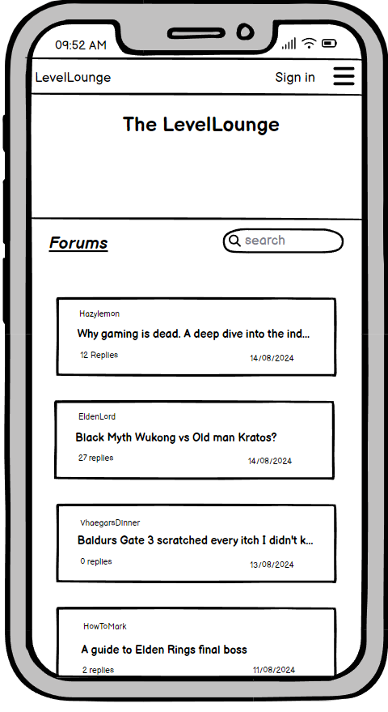

# The Level Lounge
Welcome to Level Lounge, a vibrant online community designed for gamers, creators, and enthusiasts alike! Our forum is more than just a place to chat about games; it's a dynamic space where you can connect, share, and collaborate with others who share your passion for gaming.

🎮 What is Level Lounge?

Level Lounge is an open forum where users can dive into a variety of topics, from casual gaming discussions to in-depth strategy debates and everything in between. Whether you’re here to chat about your favorite game, find teammates for your next raid, or discuss the latest trends in game development, Level Lounge has a place for you.

🗨️ Engage in Meaningful Conversations

We believe in the power of community. At Level Lounge, you can engage in both lighthearted and meaningful conversations about the gaming world. Our forum is designed to foster thoughtful discussions, share advice, and connect like-minded individuals. Whether you’re a seasoned pro or a newcomer, your voice matters here.

🤝 Collaborate and Create

Level Lounge isn’t just about conversation; it’s about creation. Connect with others to form parties, collaborate on game-related media, or even team up for game jams and other creative projects. Share your work, get feedback, and find fellow creators to help bring your visions to life.

🔐 Secure User Login

To keep our community safe and secure, Level Lounge features a robust user login system. Create your profile, customize your avatar, and start contributing to the community today.

🏆 Reputation and Recognition

Earn reputation points by contributing to discussions, helping others, and sharing your expertise. Climb the ranks, earn badges, and become a recognized member of the Level Lounge community!

🚀 Join the Conversation

Dive in, introduce yourself, and start exploring everything Level Lounge has to offer. Whether you're here to learn, collaborate, or just hang out, we’re excited to have you as part of our growing community. Let’s level up together!

[App Link](https://level-lounge-16ccb4ef258a.herokuapp.com/)

- [User Experience](#user-experience)
  - [User Stories](#user-stories)
  - [Site Goals](#site-goals)
- [Design](#design)
  - [Color Scheme](#color-scheme)
  - [Databse Schema](#fonts)
- [Planning](#planning)
  - [Wireframse](#wireframes)
  - [Entity Relationship Diagram](#erd)
  - [Agile Methodology](#agile-methodology)
    - [Milestones](#milestones)
    - [Epics](#epics)
    - [Issues](#issues)
    - [Labels](#labels)
    - [MoSCoW Prioritization](#MoScoW)
    - [Fibonacci Scale](#fibonacci-scale)
    - [Kanban Board](#kanban-board)
- [Features](#navigation)
  - [Navigation](#navigation)
    - [Login](#log-in)
    - [Logout](#log-out)
    - [Signup](#signup)
  - [Footer](#footer)
  - [Landing Page](#landing-page)
  - [Profile Page](#profile-page)
  - [Create Post](#create-post)
  - [Edit Post Page](#edit-post)
  - [Delete Post Modal](#delete-post-modal)
  - [Edit Profile Modal](#edit-profile-modal)
  - [Comments](#comments)
  - [Nested Replies](#nested-replies)
  - [Reply Button Dropdown](#reply-button-dropdown)
  - [Profile Image](#profile-image)
  - [Default Avatar](#default-avatar)
  - [User Drafts](#user-drafts)
  - [Users Posts](#users-posts)
  - [Joined On](#joined-on)
  - [Posts Created](#posts-created)
  - [Python Messages](#python-messages)
- [Future Features](#future-features)
- [Languages Used](#languages-used)
- [Technologies Used](#technologies-used)
- [Testing](#testing)
- [Deployment](#deployment)
  - [Deploy to Heroku](#deploy-to-heroku)
  - [Forking Repo](#forking-repo)
  - [Clone Repo](#clone-repo)
- [Credits](#credits)
  - [Content](#content)
  - [Media](#media)
  - [Acknowledgements](#acknowledgements)


## User Experience 👤

The user experience of Level Lounge is designed to be intuitive, engaging, and inclusive for all types of users, from casual gamers to avid forum participants. The clean and responsive interface ensures easy navigation across devices, providing users with a seamless browsing experience whether they are on a desktop or mobile device. Key features such as user profiles, nested comments, and intuitive navigation menus are thoughtfully designed to promote community interaction and make content discovery straightforward. The platform emphasizes accessibility and usability, with clear visual hierarchies, readable typography, and interactive elements that respond smoothly to user actions. This focus on user-centric design aims to create a welcoming environment that encourages users to engage in meaningful discussions and return regularly to contribute to the community.


### User Stories

Each user story consists of multiple tasks that align with acceptance criteria, all of which must be met for the story to be closed. The full breakdown of tasks and criteria is available in the [TESTING.md file](#testing).

### Uncompleted Stories
- S3: User can like posts - 5 points, Epic 2, Won't have
- S4: Unit and Integration Testing - 8 points, Epic 5, Won't have
- S3: Search and Filtering - 8 points, Epic 2, Won't have
- S2: Basic Game Rating System - 5 points, Epic 2, Won't have
- User Story 0.4: DiceBear Integration Planning - 3 points, Epic 6, Won't have

### Completed Stories
- S4: Display Post Count on Profile - 3 points, Epic 4, Should have
- S3: Click Usernames to View Profiles - 5 points, Epic 2, Should have
- S3: View Own Posts and Drafts - 8 points, Epic 2, Must have
- S2: Edit Profile and Bio - 13 points, Epic 2, Must have
- S1: Edit and delete forum posts - 5 points, Epic 3, Must have
- User Story 0.7: User Logout - 3 points, Epic 1, Must have
- User Story 0.6: User Login - 3 points, Epic 1, Must have
- S3: Comments - 13 points, Epic 2, Should have
- S1: Create Posts - 5 points, Epic 3, Must have
- S3: Integrate DiceBear API for User Avatars - 5 points, Epic 4, Won't have
- S4: Final Documentation - 8 points, Epic 3, Must have
- S4: Final Deployment - 5 points, Epic 3, Must have
- S4: Bug Fixes and Refinements - 8 points, Epic 5, Must have
- S3: User Profile Setup - 5 points, Epic 1, Must have
- S2: Forum Moderation Tools - 8 points, Epic 2, Must have
- S2: Forum Creation and Setup - 8 points, Epic 2, Must have
- S1: Admin Panel Setup - 8 points, Epic 3, Must have
- S1: Database Setup - 5 points, Epic 3, Must have
- S1: Home Page Setup - 3 points, Epic 2, Must have
- S1: User Registration and Login - 8 points, Epic 1, Must have
- User Story 0.5: User Stories and Backlog Creation - 3 points, Must have
- User Story 0.3: Set Up Development Environment - 3 points, Epic 6, Must have
- User Story 0.2: Database Design & ERD - 5 points, Epic 6, Must have
- User Story 0.1: Wireframing & UI Design - 5 points, Epic 6, Must have

### Site Goals

The primary goal of Level Lounge is to foster a vibrant and interactive community centered around gaming discussions, reviews, and shared experiences. The site aims to provide a safe and moderated space where users can express their opinions, ask questions, and connect with like-minded individuals. By offering a range of features such as customizable user profiles, threaded discussions, and engaging content, Level Lounge seeks to build a loyal user base that values thoughtful dialogue and constructive feedback. The platform aspires to grow into a leading gaming forum that not only meets the needs of its current users but also attracts new members through continuous feature enhancements, excellent user support, and a commitment to community-driven content.

## Design 🎨

The design of Level Lounge is centered around creating an engaging, user-friendly, and visually appealing environment that reflects the vibrant nature of the gaming community. The color palette uses a bold combination of gold (#ffd700) and dark tones, including deep grays and blues, to create a striking contrast that captures attention while maintaining a modern, sleek aesthetic. This design choice not only enhances the visual appeal but also improves readability, providing a comfortable browsing experience across all devices.

### **Design Principles and Thought Process**
- **Consistency**: Consistent use of colors, fonts, and button styles across all pages ensures a cohesive look and feel. This consistency helps users navigate intuitively, making interactions predictable and reducing cognitive load.
  
- **Contrast and Visual Hierarchy**: The high contrast between the bold gold and dark background elements establishes a clear visual hierarchy, guiding the user's eye naturally to important elements like navigation buttons, headings, and call-to-action links. This approach helps users quickly find what they’re looking for, enhancing overall usability.

- **Accessibility**: Accessibility was a key consideration, with a focus on clear fonts, appropriate contrast ratios, and a layout that supports screen readers and keyboard navigation. The design ensures that all users, including those with visual impairments, can easily access and interact with the content.

- **User-Centric Layouts**: Pages are designed with the user journey in mind. The landing page presents a welcoming introduction with clear navigation options, encouraging exploration of the forum. Profile pages are personalized, showcasing user details, bio, and contributions in an organized and visually appealing manner. The layout emphasizes ease of use, keeping the user’s needs at the forefront.

- **Responsive Design**: The design is fully responsive, adapting seamlessly to different screen sizes, from desktops to mobile devices. This responsiveness ensures that the forum is accessible and functional across all devices, providing a consistent user experience.

### **Why the UX is Good**
The user experience is at the heart of Level Lounge’s design. By prioritizing readability, accessibility, and intuitive navigation, the site provides a welcoming environment that encourages user engagement. The clean, structured layouts reduce clutter, making it easy for users to find information, contribute to discussions, and manage their profiles. The vibrant color scheme reflects the energy of the gaming community, creating a fun yet professional atmosphere that appeals to a broad audience. Overall, the design choices support a user-centric approach, ensuring that Level Lounge is not just a forum, but a community space where users feel comfortable and motivated to participate.

### Color Scheme 

The color scheme of Level Lounge is designed to create an inviting and energetic atmosphere that reflects the vibrant world of gaming. Dominated by shades of gold, navy and gray the theme evokes warmth, enthusiasm, and a sense of adventure, making every interaction feel dynamic and engaging. This bright and bold palette not only enhances readability but also brings a touch of excitement to the forum, encouraging users to explore and participate. The color scheme is carefully balanced to ensure that important elements like buttons, links, and notifications stand out, guiding users intuitively through the platform while maintaining a cohesive and visually appealing experience.

<details><summary>Color Scheme</summary>

</details>

### Database Schema

The database schema for Level Lounge is designed to manage users, forum posts, comments, and nested replies efficiently, providing a scalable foundation for the platform. Below is an overview of the key models, their fields, and the relationships between them, reflecting the core functionalities of the forum.

### **1. UserProfile Model**
- **Description**: This model extends the default Django User model by adding custom fields to provide additional user profile details. It holds information such as the user's bio, profile picture, and post count.
- **Fields**:
  - `user` (OneToOneField): Links to the Django User model, establishing a one-to-one relationship to extend user details.
  - `bio` (TextField): An optional field allowing users to add a personal biography.
  - `profile_picture` (CloudinaryField): Manages user profile images, with a default avatar provided for those who do not upload one.
  - `post_count` (PositiveIntegerField): Tracks the number of posts created by the user, updating dynamically as users contribute content.
  - `joined_on` (DateTimeField): Automatically records the timestamp when the profile is created, providing a historical view of the user’s activity.

### **2. Post Model**
- **Description**: Represents individual forum posts created by users. Each post contains a title, content, and status (draft or published). This model includes fields for timestamps, slugs for URL-friendly links, and an excerpt for summarizing the content.
- **Fields**:
  - `title` (CharField): The title of the post, required to be unique to ensure each post has a distinct identity.
  - `slug` (SlugField): Auto-generated from the title, used to create readable and SEO-friendly URLs.
  - `content` (TextField): The main content of the post, allowing for long-form text.
  - `created_at` (DateTimeField): Automatically records when the post is first created.
  - `updated_at` (DateTimeField): Automatically updates when the post is edited, providing a record of changes.
  - `author` (ForeignKey): Links the post to the user who created it, establishing ownership and enabling user-specific queries.
  - `status` (IntegerField): Indicates whether the post is a draft or published, with choices defined as (0, "Draft") and (1, "Published").
  - `excerpt` (TextField): A brief summary of the post, displayed in listings or previews to give readers a quick idea of the content.

### **3. Comment Model**
- **Description**: Manages comments on posts, supporting nested replies to create discussion threads. Comments can be direct responses to a post or replies to other comments, forming multi-level conversations.
- **Fields**:
  - `post` (ForeignKey): Links the comment to the associated post, ensuring comments are displayed in the correct context.
  - `content` (TextField): The main text of the comment, allowing users to share their thoughts and feedback.
  - `created_at` (DateTimeField): Automatically records the time the comment is made, showing the sequence of interactions.
  - `user` (ForeignKey): Identifies the user who made the comment, linking feedback to its creator.
  - `parent` (ForeignKey): An optional field allowing comments to be replies to other comments, supporting nested comment threads with multi-level hierarchies.

### **Schema Relationships**
- **UserProfile and User**: A one-to-one relationship extends the default User model with additional fields tailored to the forum's needs.
- **Post and User**: Each post is linked to its creator via a foreign key, ensuring that all content is attributed correctly to the author.
- **Comment and Post**: Comments are directly linked to their respective posts, maintaining contextual relevance and enabling threaded discussions.
- **Nested Comments**: Through the `parent` field, comments can recursively reference other comments, creating nested threads for in-depth discussions.

The Level Lounge database schema is designed to be flexible and robust, accommodating current functionality while providing room for future expansion. This structure ensures efficient data handling, clear relationships between user-generated content, and the scalability needed to support a growing community.

## Planning🧬

### WireFrames

The initial wireframes for Level Lounge were created to guide the development of the site’s layout, navigation, and overall user interface. The designs included key pages such as Home, Forum, User Profile, and Login, with both desktop and mobile variations considered. As the project evolved, some artistic changes were made to enhance the visual appeal and functionality, aligning the design closer to the site’s vibrant gaming community theme. Notably, the About page was integrated into the landing page’s welcome message, as it was determined that a separate About page was unnecessary, streamlining the user experience.

### Desktop Wireframes
- <details><summary>About Page (Desktop)</summary>
  </details>
  - The original wireframe included a dedicated About page. However, during development, this page was merged into the landing page to simplify navigation and avoid redundancy. The information is now presented through a welcoming message that sets the tone for the site.

- <details><summary>Forum Expand (Desktop)</summary>
  </details>
  - The forum wireframe envisioned an expandable thread view. The final design refined this feature to make navigation more intuitive, prioritizing clear visual hierarchies and improved readability.

- <details><summary>Home Page (Desktop)</summary>
  </details>
  - The home page design remained largely faithful to the wireframe, with minor adjustments made to the color scheme and typography to enhance visual contrast and accessibility.

- <details><summary>Logged In (Desktop)</summary>
  </details>
  - This wireframe showcased the navigation adjustments when a user is logged in. Final tweaks included refining the dropdown menu and ensuring key actions like logout were easily accessible.

- <details><summary>Login Page (Desktop)</summary>
  </details>
  - The login page wireframe was implemented as designed, with a focus on simplicity and clear feedback for authentication errors.

- <details><summary>My Account Page (Desktop)</summary>
  </details>
  - The My Account page was fully realized from this wireframe, allowing users to manage their profiles effectively. Some artistic changes included adjusting the layout for better information hierarchy.

- <details><summary>Search Page (Desktop)</summary>
  </details>
  - The search functionality did not make the final product due to time constraints but will be added in future development.

- <details><summary>Signup Page (Desktop)</summary>
  </details>
  - The signup page followed the wireframe closely, with added emphasis on error validation messages to guide users through the registration process.

### Mobile Wireframes
- <details><summary>About Page (Mobile)</summary>
  </details>
  - The mobile wireframe for the About page was ultimately not used, as the content was integrated into the main landing page to reduce navigation layers and keep the user journey smooth.

- <details><summary>Comments Section (Mobile)</summary>
  </details>
  - The comments section was designed to handle nested replies, with adjustments made in the final implementation to improve readability on smaller screens.

- <details><summary>Forum Page (Mobile)</summary>
  </details>
  - The forum page wireframe was adapted with a focus on mobile responsiveness, ensuring that all elements were easily accessible without compromising on the forum's functionality.

- <details><summary>Home Page (Mobile)</summary>
  </details>
  - The home page design was tailored for mobile, ensuring that navigation and core content were prioritized for a seamless browsing experience on the go.

- <details><summary>Login Page (Mobile)</summary>
  </details>

- <details><summary>My Account Page (Mobile)</summary>
  </details>

- <details><summary>Navigation Dropdown (Mobile)</summary>
  </details>
  - The navigation dropdown wireframe highlighted how users would interact with site menus on mobile. The final implementation ensured smooth transitions and clear, tappable options.

- <details><summary>Search Page (Mobile)</summary>
  </details>

- <details><summary>Signup Page (Mobile)</summary>
  </details>

Overall, the wireframes served as a critical blueprint in the development process, guiding both the design and functionality of Level Lounge. The artistic changes made during implementation were aimed at enhancing the user experience, ensuring that the final product was not only visually appealing but also highly functional and accessible across devices.

### ERD

The Entity-Relationship Diagram (ERD) visually represents the database structure, detailing the relationships between users, posts, and comments. It ensures the data model aligns with the application's requirements, supporting core features like user profiles, nested comments, and post management.

- <details><summary>ERD</summary>
  </details>

### Flowchart

The flowchart provides a high-level overview of the user interactions within Level Lounge. It maps out key user journeys, including account management, post creation, and comment interactions, ensuring a smooth and logical flow through the site.

- <details><summary>Flowchart</summary>
  </details>

### Agile Methodology

The Agile Methodology was employed throughout the development of Level Lounge to ensure a structured and efficient workflow. This approach facilitated iterative progress, regular feedback loops, and the prioritization of key features to meet project goals within the set deadlines. The development process was organized into sprints, identified by user story names such as S1, S2, etc., which effectively served as milestones for the project.

#### Milestones

The project was broken down into milestones that marked significant phases of development, ensuring that key objectives were met on time and in the correct order. Milestones helped track progress and served as checkpoints for reviewing completed work before moving forward.

- <details><summary>Milestones</summary>
  </details>

#### Epics

Epics were used to group related user stories and tasks into larger units of work, making it easier to manage and prioritize features that spanned multiple sprints. Each epic represented a major component of the project, such as user authentication or forum functionality.

- <details><summary>Epics</summary>
  </details>

#### Issues

Issues were logged in GitHub to track tasks, bugs, and enhancements throughout the project. These issues were essential for managing the workload, assigning tasks, and maintaining a clear record of progress. 

**Issues Expanded**

- <details><summary>Open Issues</summary>
  </details>
  
- <details><summary>Closed Issues</summary>
  </details>
  
- <details><summary>Issue Criteria and Tasks</summary>
  </details>

#### MoSCoW

The MoSCoW method was used to organize and prioritize tasks into Must Have, Should Have, Could Have, and Won't Have categories. A key learning experience was the realization that too many tasks were categorized as Must Haves, focusing heavily on the core functionality of a well-working forum. This left little time to implement Should Have or Could Have tasks, highlighting the importance of balancing priorities. Ideally, Must Haves should not take up more than 60% of any sprint.

- <details><summary>MoSCoW Method</summary>
  </details>

#### Fibonacci Scale

The Fibonacci Scale was used for task estimation, assigning point values to user stories based on their complexity and effort required. This approach helped ensure that the workload was manageable within each sprint and that tasks were realistically planned.

- <details><summary>Fibonacci Scale</summary>
  </details>

#### Kanban Board

The Kanban Board was utilized to visually track the status of tasks from To Do, In Progress, to Done. This board provided a clear and dynamic view of the project’s progress, helping to keep the team on track and ensuring that tasks were completed in an organized manner.

- <details><summary>Kanban Board</summary>
  </details>


## Features⚙️
### Navigation
<details><summary>Navigation</summary> 

</details>

The navigation bar provides easy access to the main sections of the forum, such as Home, Profile, and Login/Logout. It is styled for clear visibility and includes hover effects for an interactive feel. The navigation ensures users can seamlessly browse the forum, enhancing the overall user experience.

### Logged-Out Navigation
<details><summary>Logged-Out Navigation</summary> 

</details>

When logged out, the navigation adjusts to show options relevant to non-authenticated users, like login and signup links, enhancing accessibility for new and returning visitors. Also, hiding the nav link for the profile as a logged out user cannot have a profile.

### Login
<details><summary>Login</summary> 

</details>

The login functionality uses Django's built-in `LoginView` to authenticate users, ensuring secure access to the platform. It allows users to log in and access personalized features like posting content and interacting with other users. This feature is crucial for maintaining the integrity of the forum and protecting user data.

### Logout
<details><summary>Logout</summary> 

</details>

The logout function allows users to safely exit their accounts, clearing their session data. This feature, also handled by Django's built-in `LogoutView`, ensures user data is protected and offers peace of mind, especially for users accessing the forum on shared devices.

### Signup
<details><summary>Signup</summary> 

</details>

The signup feature allows new users to register for an account, granting them access to all the interactive features of Level Lounge. By enabling user registration, the forum grows its community, encouraging more engagement and content creation.

### Footer
<details><summary>Footer</summary> 

</details>

The footer provides additional navigation links and other important information, creating a cohesive and professional look for the site. It is styled consistently with the rest of the website, keeping the design user-friendly and visually appealing.

### Landing Page
<details><summary>Landing Page</summary> 

</details>

The landing page welcomes users to Level Lounge, offering a quick overview of the forum’s purpose and main features. It serves as the entry point and sets the tone for the rest of the site, engaging users right from their first interaction.

### Profile Page
<details><summary>Profile Page</summary> 

</details>

The profile page displays user information, including their bio, profile picture, posts, and other user-specific data like drafts and joined date. This page allows users to personalize their presence on the forum and easily manage their content, fostering a sense of community.

### Create Post
<details><summary>Create Post</summary> 

</details>

The Create Post feature allows users to contribute to the forum by writing and sharing content. This feature supports user-generated content, which is essential for keeping the forum dynamic and engaging.

### Logged-Out Create Post Button
<details><summary>Logged-Out Create Post Button</summary> 

</details>

When logged out, the create post button is replaced with a link that directs users to the login page, guiding them to sign in or register before contributing to the forum.

### Edit Post Page
<details><summary>Edit Post Page</summary> 

</details>

The Edit Post Page enables users to modify their posts after publishing, allowing them to correct errors or update content as needed. This flexibility improves the quality of content on the forum and empowers users to maintain their contributions.

### Delete Post Modal
<details><summary>Delete Post Modal</summary> 

</details>

The Delete Post Modal provides a confirmation dialog when a user attempts to delete a post, preventing accidental deletions. It enhances user experience by ensuring that significant actions like deletions are intentional.

### Edit Profile Modal
<details><summary>Edit Profile Modal</summary> 

</details>

The Edit Profile Modal allows users to update their profile information, such as their bio and profile picture. This feature supports personalization, helping users express themselves within the community.

### Comments
<details><summary>Comments</summary> 

</details>

The comments feature allows users to engage with posts through feedback and discussions. It is a core element of interaction on the forum, encouraging communication and deeper engagement with the content.

### Logged-Out Comments
<details><summary>Logged-Out Comments</summary> 

</details>

When logged out, users can still view comments but cannot interact with them, maintaining transparency and readability without compromising the integrity of user interactions.

### Nested Replies
<details><summary>Nested Replies</summary> 

</details>

Nested replies enable users to respond to comments, creating threaded discussions. This feature allows for organized conversations, making it easier for users to follow and participate in ongoing discussions.

### Reply Button Dropdown
<details><summary>Reply Button Dropdown</summary> 

</details>

The Reply Button Dropdown offers a simple way for users to respond directly to comments with options to tag or address specific replies. This feature streamlines user interaction and makes the comment section more intuitive.

### Profile Image
<details><summary>Profile Image</summary> 

</details>

Profile images allow users to upload and display a personal photo, adding a visual element to their presence on the forum. This feature supports personalization and helps to foster a sense of identity and community among users.

### Default Avatar
<details><summary>Default Avatar</summary> 

</details>

The default avatar is displayed when a user has not set a custom profile image, ensuring a consistent and professional appearance across the forum. It also encourages users to personalize their profiles by setting their own images.

### User Drafts
<details><summary>User Drafts</summary> 

</details>

The User Drafts feature allows users to save their posts as drafts before publishing, enabling them to work on content over time. This feature supports content creation by giving users the flexibility to perfect their posts before sharing.

### Users Posts
<details><summary>Users Posts</summary> 

</details>

The Users Posts section on the profile page shows all posts created by the user, making it easy for them and others to see their contributions. This feature helps highlight active members of the community and encourages more interaction.

### Joined On
<details><summary>Joined On</summary> 

</details>

The "Joined On" date on the profile page shows when a user became a member of the forum, giving context to their activity and presence. It helps build a sense of longevity and community among users.

### Posts Created
<details><summary>Posts Created</summary> 

</details>

This feature displays the total number of posts created by a user on their profile, highlighting their level of activity and contribution to the forum. It provides recognition for active users and encourages engagement.

### Python Messages
<details><summary>Python Messages</summary> 

</details>

Python messages are used throughout the application to provide feedback to users, such as success or error messages when performing actions. These messages improve user experience by offering clear communication about what’s happening on the site.

### Drafts with No Comments
<details><summary>Drafts with No Comments</summary> 

</details>

When a post is saved as a draft (status set to 0), comments are disabled to maintain privacy and prevent interaction until the post is published. This feature ensures that drafts remain a personal workspace for users to refine their content before sharing it with the community.

### 404 Page
<details><summary>404 Page</summary> 

</details>

The custom 404 page is displayed when users attempt to access a page that does not exist. It provides a friendly message and a link to navigate back to safety, enhancing the overall user experience by helping users find their way back without frustration.


## Future Features 🔮

As Level Lounge continues to grow, numerous features can be added to enhance user experience, improve engagement, and expand the platform’s functionality. Below are detailed descriptions of future features that could be implemented:

### 1. Advanced Nested Comment Management
- **Feature Description**: Currently, nested comments can become distorted if replies go too deep (15+ levels). An advanced management system for nested comments, including a collapse/expand function for deep comment threads, would enhance readability and usability.
- **Benefit**: This would allow users to navigate comment threads more easily, reducing visual clutter and making long discussions easier to follow.

### 2. Private Messaging System
- **Feature Description**: Implementing a private messaging system would allow users to communicate directly with each other, fostering a more connected community.
- **Benefit**: This feature would enhance user engagement by providing a way to discuss topics privately without leaving the forum platform.

### 3. Enhanced User Profiles
- **Feature Description**: Expand user profiles to include additional details such as user badges, activity history, favorite threads, and a list of followed users or topics.
- **Benefit**: Enhanced profiles would encourage users to participate more actively and allow them to showcase their forum contributions.

### 4. Reputation and Badging System
- **Feature Description**: Introduce a reputation system where users earn points or badges for participating in discussions, receiving upvotes, or completing specific actions.
- **Benefit**: This would incentivize positive contributions, reward active users, and build a sense of achievement within the community.

### 5. Polls and Surveys
- **Feature Description**: Allow users to create polls and surveys within threads to gather opinions or feedback on specific topics.
- **Benefit**: Polls and surveys can drive engagement by allowing users to interact with content in a more dynamic way, sparking discussions based on poll results.

### 6. Moderation Tools and Reporting System
- **Feature Description**: Develop advanced moderation tools, including user reporting, automated flagging of inappropriate content, and a streamlined process for moderators to review and manage reports.
- **Benefit**: Enhancing moderation capabilities will help maintain a positive community environment and ensure the forum remains welcoming and safe.

### 7. Content Tagging and Search Filters
- **Feature Description**: Introduce tagging for posts and advanced search filters to help users find relevant threads quickly based on tags, keywords, or categories.
- **Benefit**: Improved searchability will enhance user experience by making it easier to discover content, encouraging users to engage with topics of interest.

### 8. Topic Subscription and Notifications
- **Feature Description**: Allow users to subscribe to threads, receive notifications for new replies, and get alerts when they are mentioned in a discussion.
- **Benefit**: This feature keeps users engaged with content they are interested in and fosters a sense of ongoing conversation, even when users are not actively browsing the forum.

### 9. Gamification Features
- **Feature Description**: Add gamification elements such as leaderboards, achievements, and daily challenges to encourage ongoing participation and competition among users.
- **Benefit**: Gamification can significantly boost engagement by making the forum experience more fun and rewarding for active users.

### 10. Dark Mode and Theme Customization
- **Feature Description**: Provide options for users to switch between light and dark modes or customize the forum’s appearance with different themes.
- **Benefit**: Theme customization improves accessibility, accommodates user preferences, and can enhance the overall aesthetic appeal of the forum.

### 11. SEO Optimization and Meta Tags
- **Feature Description**: Implement advanced SEO techniques, including the addition of meta tags, structured data, and optimization of page load times to improve search engine rankings.
- **Benefit**: Improved SEO will increase the forum’s visibility, attract new users, and help grow the community organically.

### 12. Integration with Social Media
- **Feature Description**: Enable users to share threads or posts directly to social media platforms such as Twitter, Facebook, and LinkedIn.
- **Benefit**: Social media integration increases content reach, promotes community growth, and allows users to engage with the forum in new ways.

### 13. Accessibility Enhancements
- **Feature Description**: Implement accessibility improvements, such as screen reader compatibility, keyboard navigation support, and high-contrast modes.
- **Benefit**: These enhancements will ensure that the forum is inclusive and accessible to users with disabilities, broadening the user base.

### 14. Advertising and Sponsorship Opportunities
- **Feature Description**: Introduce options for advertising and sponsored content within the forum, allowing brands to engage with the community in a structured way.
- **Benefit**: This could create additional revenue streams to support the ongoing development and maintenance of the forum.

### 15. Integration with External APIs
- **Feature Description**: Explore integrations with external APIs, such as gaming news, reviews, or live streams, to enrich the content and provide additional value to users.
- **Benefit**: External integrations can keep the forum content fresh and relevant, offering users more reasons to stay engaged with the platform.

### 16. Anonymous Posting and Incognito Mode
- **Feature Description**: Allow users to post anonymously or browse the forum in incognito mode, providing a layer of privacy for sensitive discussions.
- **Benefit**: This feature would encourage participation from users who may be hesitant to engage publicly, particularly on sensitive or controversial topics.

### 17. Mobile App Development
- **Feature Description**: Develop a dedicated mobile app for the forum, offering push notifications, offline access, and a tailored user experience for mobile devices.
- **Benefit**: A mobile app would increase accessibility, improve user engagement, and provide a more seamless browsing experience for users on the go.

### 18. AI-Powered Recommendations
- **Feature Description**: Implement AI-driven recommendations for related threads, trending topics, or suggested content based on user activity and interests.
- **Benefit**: Personalized recommendations keep users engaged by presenting them with content that matches their preferences, encouraging more interaction with the forum.

### 19. Scheduled Posts and Content Calendar
- **Feature Description**: Allow users, particularly moderators or content creators, to schedule posts or announcements to be published at specific times.
- **Benefit**: Scheduled posts can help maintain a steady flow of content, particularly during peak times, and allow for better content planning.

### 20. Data Analytics Dashboard for Admins
- **Feature Description**: Create a comprehensive analytics dashboard for administrators to track user engagement, post popularity, and overall forum health metrics.
- **Benefit**: This feature would help administrators make data-driven decisions to improve user experience, identify trends, and address potential issues proactively.

These future features represent a broad range of opportunities to expand and enhance Level Lounge, creating a more dynamic, engaging, and user-friendly platform for all community members. Implementing these features over time will help the forum evolve, attract new users, and maintain its position as a go-to destination for gaming discussions.

## Technologies Used📡

Level Lounge is built using a modern technology stack that ensures a responsive, reliable, and interactive user experience. Below is a breakdown of the key technologies, tools, and services used in this project.

### Languages Used

- **Python**: Used for backend development, Python powers the core logic of the application, handling server-side operations, data processing, and integration with third-party services. [Python Official Site](https://www.python.org/)
- **HTML**: Structures the content of the website, forming the backbone of the web pages. [HTML Documentation](https://developer.mozilla.org/en-US/docs/Web/HTML)
- **CSS**: Used to style the HTML, ensuring the site is visually appealing, responsive, and in line with the design theme. [CSS Documentation](https://developer.mozilla.org/en-US/docs/Web/CSS)
- **JavaScript**: Adds interactivity to the frontend, allowing dynamic elements and enhancing the user experience. [JavaScript Documentation](https://developer.mozilla.org/en-US/docs/Web/JavaScript)

### Frameworks and Libraries

- **[Django](https://www.djangoproject.com/)**: A high-level Python web framework that encourages rapid development and clean, pragmatic design. Django handles everything from URL routing and views to database interactions and security.
- **[Bootstrap 5](https://getbootstrap.com/)**: Integrated via `django-crispy-forms` and `crispy-bootstrap5` to enhance UI components with modern, responsive design elements.

### Tools and Services

- **[favicon.io](https://favicon.io/)**: Used to generate and customize favicons for the site, ensuring a branded look across tabs and bookmarks.
- **[ChatGPT](https://openai.com/chatgpt/)**: Assisted in developing code, documentation, and troubleshooting during the project.
- **[Heroku](https://www.heroku.com/)**: A cloud platform used for deploying the application, managing the production environment, and scaling the app as needed.
- **[Git/GitHub](https://github.com/)**: Version control tools used for code management, collaboration, and deployment workflow, ensuring smooth development and release cycles.

### Key Dependencies

- **[asgiref](https://pypi.org/project/asgiref/)**: Provides support for asynchronous web frameworks in Python, used as part of Django’s async features.
- **[black](https://black.readthedocs.io/en/stable/)**: A code formatter that enforces consistent coding style, ensuring readable and maintainable code.
- **[click](https://click.palletsprojects.com/)**: A package used to create command-line interfaces in Python, aiding in script automation.
- **[cloudinary](https://cloudinary.com/)**: Manages media uploads and storage in the cloud, facilitating image handling and optimization.
- **[crispy-bootstrap5](https://django-crispy-forms.readthedocs.io/en/latest/)**: A Django package that provides Bootstrap 5 compatible form rendering, improving form layouts and styling.
- **[dj-database-url](https://pypi.org/project/dj-database-url/)**: Simplifies database configuration in Django, especially useful for deploying to production environments like Heroku.
- **[dj3-cloudinary-storage](https://pypi.org/project/dj3-cloudinary-storage/)**: Integrates Cloudinary storage with Django, allowing seamless handling of media files.
- **[django-allauth](https://django-allauth.readthedocs.io/en/latest/)**: Provides a complete authentication system, supporting user registration, login, and social authentication.
- **[django-cloudinary-storage](https://pypi.org/project/django-cloudinary-storage/)**: Manages static and media files on Cloudinary, optimizing storage and delivery.
- **[django-crispy-forms](https://django-crispy-forms.readthedocs.io/en/latest/)**: Enhances form rendering in Django, making it easy to style forms with Bootstrap.
- **[django-debug-toolbar](https://django-debug-toolbar.readthedocs.io/en/latest/)**: A debugging tool that provides detailed information about database queries, request/response cycles, and more during development.
- **[django-summernote](https://django-summernote.readthedocs.io/en/latest/)**: Adds a rich text editor to Django, allowing users to create and edit posts with formatted content.
- **[gunicorn](https://gunicorn.org/)**: A Python WSGI HTTP server used to serve the Django application in production.
- **[oauthlib](https://oauthlib.readthedocs.io/en/latest/)**: A library for OAuth protocol implementation, supporting secure authentication flows.
- **[pathspec](https://pypi.org/project/pathspec/)**: Used by Black and other tools to define patterns for excluding files during formatting.
- **[pillow](https://pillow.readthedocs.io/en/stable/)**: A Python Imaging Library used for image processing, crucial for handling profile pictures and other media.
- **[psycopg2](https://www.psycopg.org/)**: A PostgreSQL adapter for Python, enabling Django to interact with the PostgreSQL database.
- **[PyJWT](https://pyjwt.readthedocs.io/en/latest/)**: A library for working with JSON Web Tokens (JWT), often used for authentication purposes.
- **[python-dotenv](https://pypi.org/project/python-dotenv/)**: Manages environment variables, allowing sensitive information to be kept out of the codebase.
- **[python3-openid](https://github.com/necaris/python3-openid)**: Provides OpenID support for authentication, enhancing user login options.
- **[requests-oauthlib](https://requests-oauthlib.readthedocs.io/en/latest/)**: Combines the requests library with OAuth to simplify authentication in Python.
- **[sqlparse](https://sqlparse.readthedocs.io/en/latest/)**: A SQL parser used by Django for handling complex query formatting.
- **[urllib3](https://urllib3.readthedocs.io/)**: A powerful HTTP client for Python, used internally by many libraries.
- **[whitenoise](http://whitenoise.evans.io/en/stable/)**: Simplifies static file handling in production, allowing Django to serve static files without a separate web server.

### Additional Tools and Validators

- **[Lucidchart](https://www.lucidchart.com/)**: A visual workspace that combines diagramming, data visualization, and collaboration to accelerate understanding and drive innovation. Used for creating flowcharts, wireframes, and other design diagrams to help plan and visualize the application structure. 
- **[autopep8](https://pypi.org/project/autopep8/)**: A tool that automatically formats Python code to conform to the PEP 8 style guide. This helps maintain consistent and clean code throughout the project.
- **[JSHint](https://jshint.com/)**: A JavaScript code quality tool that helps detect errors and potential problems in JavaScript code. It is used to ensure that the JavaScript code in the project adheres to best practices and standards.
- **[W3C HTML Validator](https://validator.w3.org/)**: A service provided by the World Wide Web Consortium (W3C) that checks the markup validity of web documents in HTML, XHTML, SMIL, MathML, etc. It helps ensure the HTML code is compliant with web standards.
- **[W3C CSS Validator](https://jigsaw.w3.org/css-validator/)**: A tool provided by the W3C to check Cascading Style Sheets (CSS) for errors and conformance to W3C standards. It ensures that the CSS is valid and optimized for web performance and compatibility.

---

These technologies collectively form the foundation of Level Lounge, offering robust backend support, engaging frontend experiences, and efficient deployment and maintenance workflows.

## Testing👨‍🔬

All testing was carried out in my [TESTING.md](/TESTING.md) file.

## Deployment🚀

Deploying your project correctly ensures that it runs smoothly in a production environment. Below are detailed instructions for deploying Level Lounge to Heroku, and how to fork and clone the repository for development or customization purposes.

### Deploy to Heroku

Heroku is a cloud platform that allows developers to deploy, manage, and scale applications. Here’s how to deploy Level Lounge to Heroku:

1. **Set Up Your Heroku Account**:
   - Create an account on [Heroku](https://www.heroku.com/) if you haven't already.
   - Install the Heroku CLI on your machine: [Heroku CLI Installation Guide](https://devcenter.heroku.com/articles/heroku-cli).

2. **Prepare Your Application for Deployment**:
   - Ensure all your dependencies are listed in `requirements.txt` and that your `Procfile` is correctly configured:
     ```
     web: gunicorn your_project_name.wsgi
     ```

3. **Configure Environment Variables**:
   - Set environment variables for `SECRET_KEY`, `DEBUG`, and database settings. This is crucial for security and proper operation.
   - Never set `DEBUG=True` in production as it exposes sensitive data. Ensure `DEBUG=False` in production settings.
   - Use a `.env` file locally and configure variables in Heroku’s settings:
     - In your `.env` file:
       ```
       DEBUG=False
       SECRET_KEY=your_secret_key
       DATABASE_URL=your_database_url
       ```
   - On Heroku, set these variables through the Heroku Dashboard under **Settings > Config Vars** or using the Heroku CLI.

4. **Collect Static Files**:
   - If your application uses static files, ensure they are collected and served correctly:
     ```bash
     python manage.py collectstatic
     ```

5. **Deploy Your Application**:
   - Go to the **Deploy** tab in your Heroku app dashboard.
   - Under **Deployment method**, connect your GitHub repository to Heroku.
   - Scroll down to the **Manual deploy** section and select the branch you want to deploy (typically `main`).
   - Click **Deploy Branch**. Heroku will automatically build and deploy your app based on the selected branch.

6. **Check Your Deployment**:
   - Visit your deployed app at `https://your-app-name.herokuapp.com` to ensure everything is working correctly.

### Forking the Repository

Forking a repository allows you to create a personal copy of someone else's project on GitHub, which you can modify without affecting the original. Here's how to fork the Level Lounge repository:

1. **Fork the Repository**:
   - Go to the GitHub repository you want to fork.
   - Click the **Fork** button at the top right corner of the repository page. This will create a copy of the repository under your GitHub account.

2. **Clone Your Fork**:
   - After forking, clone the repository to your local machine:
     ```bash
     git clone https://github.com/your-username/your-forked-repo.git
     ```
   - Change into the cloned directory:
     ```bash
     cd your-forked-repo
     ```

3. **Set Up Upstream Remote**:
   - To keep your fork up-to-date with the original repository, add the upstream remote:
     ```bash
     git remote add upstream https://github.com/original-author/original-repo.git
     ```
   - Fetch the latest changes from upstream:
     ```bash
     git fetch upstream
     ```
   - Merge upstream changes into your local fork:
     ```bash
     git merge upstream/main
     ```

### Cloning the Repository

Cloning a repository allows you to create a local copy of a project from GitHub. Follow these steps to clone the Level Lounge repository:

1. **Clone the Repository**:
   - Navigate to the GitHub repository page you want to clone.
   - Click the **Code** button and copy the URL (HTTPS, SSH, or GitHub CLI).
   - Open your terminal and run:
     ```bash
     git clone https://github.com/username/repo-name.git
     ```
   - Replace `https://github.com/username/repo-name.git` with the URL you copied.

2. **Set Up Your Local Environment**:
   - Navigate into the cloned directory:
     ```bash
     cd repo-name
     ```
   - Install all dependencies using pip:
     ```bash
     pip install -r requirements.txt
     ```
   - Set up environment variables in a `.env` file for local development:
     ```
     DEBUG=True
     SECRET_KEY=your_local_secret_key
     DATABASE_URL=your_local_database_url
     ```

3. **Run Migrations and Start the Server**:
   - Run migrations to set up the database:
     ```bash
     python manage.py migrate
     ```
   - Start the local server:
     ```bash
     python manage.py runserver
     ```
   - Open your browser and go to `http://127.0.0.1:8000/` to see your local version of the app running.

---

These detailed deployment steps ensure that your application is securely set up, running correctly, and easily forked or cloned for further development or customization. Always double-check your environment configurations, particularly `DEBUG` and secret keys, to maintain security and proper operation in production environments.

## Credits✅

This project was built with the support of various communities, resources, and individuals who provided guidance, inspiration, and solutions to complex coding challenges. Below is a detailed acknowledgment of these contributions:

### **Communities and Forums**

- **[Reddit (r/django)](https://www.reddit.com/r/django/)**: This subreddit provided invaluable insights and solutions to common Django-related problems. Community members offered tips on improving code efficiency, debugging complex issues, and implementing best practices that enhanced the overall quality of the project.
  
- **[Stack Overflow](https://stackoverflow.com/)**: Stack Overflow was instrumental in troubleshooting and finding solutions to specific code errors and bugs encountered throughout the development process. Threads on various Django topics, including form handling, model relationships, and JavaScript integration, were particularly helpful.

- **[GitHub Discussions](https://github.com/discussions)**: Various GitHub repositories and their discussion sections were useful for finding code snippets, configuration settings, and explanations related to advanced Django functionalities.

- **[Django Documentation](https://docs.djangoproject.com/en/stable/)**: The official Django documentation served as the primary source of reference for understanding the framework’s core features, APIs, and best practices. It was crucial for learning about Django’s authentication system, query optimizations, and form handling.

### **Individuals**

- **David Bowers**: David Bowers, my mentor, provided consistent guidance, constructive feedback, and encouragement throughout the project. His advice on debugging and refining the project’s architecture was invaluable.
  
- **Marko Tot Course Cohort**: Marko Tot from the Code Institute provided continuous support and feedback, helping to test features, brainstorm ideas, and solve various challenges that arose during the development process.

### **Learning Resources**

- **[Code Institute](https://codeinstitute.net/)**: The “I Think Therefore I Blog” walkthrough from Code Institute was particularly influential in structuring the core features of the forum, including user authentication, CRUD functionalities, and comment threading. The project built upon the foundations learned from this walkthrough, extending and customizing the features to suit the specific needs of Level Lounge.

- **[CoolCoders-PP4 by Darrach Barneveld](https://github.com/DarrachBarneveld/CoolCoders-PP4)**: Darrach Barneveld’s GitHub repository provided inspiration for the structure and layout of this README and testing documentation. The detailed approach to documenting testing procedures and the clear presentation of project features served as a guiding example.

- **[MDN Web Docs](https://developer.mozilla.org/en-US/)**: The Mozilla Developer Network (MDN) was an essential resource for understanding HTML, CSS, and JavaScript standards. It provided comprehensive explanations and examples that were pivotal in debugging front-end issues and enhancing the user interface.

- **[Bootstrap Documentation](https://getbootstrap.com/docs/)**: Bootstrap’s official documentation helped with implementing responsive design components, ensuring the site’s layout remained consistent across different devices and screen sizes.

- **[W3Schools](https://www.w3schools.com/)**: W3Schools was frequently used for quick references on HTML, CSS, and JavaScript syntax, as well as for understanding the basics of various web technologies that were integrated into the project.

### **Technical Assistance and Tools**

- **ChatGPT**: ChatGPT was used to break down complex code into manageable parts and write small code snippets that were beyond my current skill level. All contributions from ChatGPT are documented within the codebase through comments to ensure proper acknowledgment. ChatGPT also assisted in providing explanations and advice on improving the readability and efficiency of my code. Also, tables were created by inputting all information into ChatGPT, and asking it to give it to me in table format, making documentation much quicker and allowing me to spend more time testing my features.

- **[Lucidchart](https://www.lucidchart.com/)**: Lucidchart was utilized for planning and designing the database structure and user flow diagrams. These visual aids were crucial for conceptualizing complex relationships and ensuring the database met the application’s needs.

- **[Favicon.io](https://favicon.io/)**: This tool was used to create a favicon that matched the branding and theme of Level Lounge, ensuring a polished and professional look for the site.

- **[AutoPEP8](https://pypi.org/project/autopep8/)**: AutoPEP8 was used to format Python code according to PEP8 standards, ensuring code consistency and readability across the entire project.

### **Agile Methodology**

- **[GitHub Issues](https://github.com/)**: GitHub Issues was utilized to implement Agile methodology throughout the development process. By creating a Kanban board, tasks were organized into sprints, allowing for efficient management of user stories, bug tracking, and feature implementation. This approach helped maintain a structured workflow, prioritize tasks, and ensure that the project stayed on track.

### **Acknowledgements**

- This project would not have been possible without the contributions and resources provided by these communities, individuals, and documentation. Their support played a crucial role in guiding this project from conception to completion. Each piece of advice, code snippet, and documentation reference contributed to the development and learning process, shaping Level Lounge into a fully functional and engaging gaming forum.
