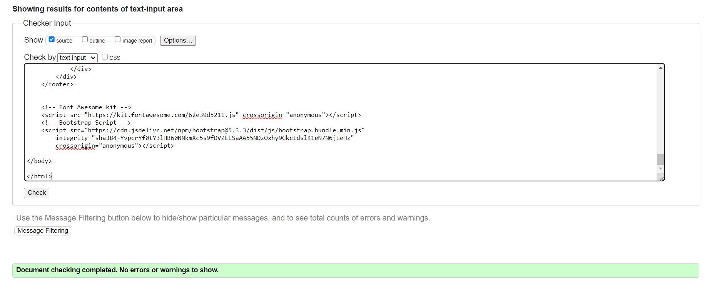
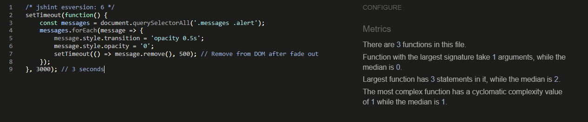
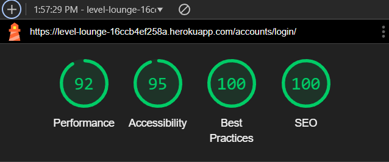

## Table of Contents

1. [User Story Testing](#user-story-testing)
2. [Validation](#validation)
    - [HTML Validation](#html)
    - [CSS Validation](#css)
    - [JavaScript Validation](#javascript)
    - [Python Validation](#python)
3. [Lighthouse Scores](#lighthouse-scores)
4. [Feature Testing Summary](#feature-testing-summary)
5. [User Authentication Tests](#user-authentication-tests)
    - [How the Tests Work](#how-the-tests-work)
    - [Why These Tests Matter](#why-these-tests-matter)
    - [Python Testing Results](#python-testing-results)
6. [Browser Testing Summary](#browser-testing-summary)
7. [Bugs](#bugs)
    - [Bug 01](#bug-01)
    - [Bug 02](#bug-02)
    - [Bug 03](#bug-03)
    - [Bug 04](#bug-04)
    - [Bug 05](#bug-05)
    - [Bug 06](#bug-06)
    - [Bug 07](#bug-07)
    - [Bug 08](#bug-08)
    - [Bug 09](#bug-09)
    - [Bug 10](#bug-10)
    - [Bug 11](#bug-11)
    - [Bug 12](#bug-12)
    - [Bug 13](#bug-13)
    - [Bug 14](#bug-14)
    - [Bug 15](#bug-15)
    - [Bug 16](#bug-16)
    - [Bug 17](#bug-17)
    - [Bug 18](#bug-18)
- [Unfixed Bugs](#unfixed-bugs)

## User Story Testing

| Iteration | User Story                        | Result            | Acceptance Criteria                                                                                                       | Tasks Completed                                                                                                                   |
|-----------|-----------------------------------|-------------------|---------------------------------------------------------------------------------------------------------------------------|----------------------------------------------------------------------------------------------------------------------------------|
| 0.1       | Wireframing and UI design         | <mark>PASS</mark> | 1. Wireframes for main pages: Home, Forum, Thread, User Profile, Admin Panel.                                             | - Created wireframes using a design tool.                                                                                         |
|           |                                   |                   | 2. UI must include navigation, key UI elements, and dynamic content placeholders.                                         | - Designed navigation bars, content sections, and user interaction elements.                                                     |
|           |                                   |                   | 3. Must follow accessibility and usability standards.                                                                     | - Reviewed and refined wireframes to meet usability standards.                                                                   |
| 0.2       | Database Design & ERD             | <mark>PASS</mark> | 1. Create ERD detailing relationships between Users, Forum Threads, Posts, Ratings, and Reputation.                       | - Designed database schema with tables, columns, and relationships.                                                              |
|           |                                   |                   | 2. Design must support core functionalities and scalability.                                                              | - Created an ERD.                                                                                                                 |
|           |                                   |                   |                                                                                                                           | - Reviewed for efficiency and scalability.                                                                                       |
| 0.3       | Set Up Development Environment    | <mark>PASS</mark> | 1. Initialize Django project with required libraries.                                                                     | - Initialized Django project and installed required libraries.                                                                   |
|           |                                   |                   | 2. Set up version control using Git and create a GitHub repo.                                                             | - Set up Git and pushed to GitHub.                                                                                               |
|           |                                   |                   | 3. Configure for local testing and debugging.                                                                             | - Configured settings for testing and debugging.                                                                                 |
| 0.4       | DiceBear Integration Planning     | <mark>DEFERRED</mark> | N/A                                                                                                                       | N/A                                                                                                                              |
| 0.5       | User Stories and Backlog Creation | <mark>PASS</mark> | 1. Create user stories with acceptance criteria and tasks.                                                               | - Wrote user stories for each core feature.                                                                                     |
|           |                                   |                   | 2. Prioritize based on importance.                                                                                        | - Prioritized stories based on project importance.                                                                               |
|           |                                   |                   | 3. Organize into 4-week sprints.                                                                                          | - Organized stories into balanced sprints.                                                                                       |
| 0.6       | User Login                        | <mark>PASS</mark> | 1. User can log in via navigation button.                                                                                 | - Added login link in navigation.                                                                                                |
|           |                                   |                   | 2. Secure login with error handling.                                                                                      | - Displayed "You are logged in as..." upon successful login.                                                                     |
|           |                                   |                   | 3. User receives confirmation of successful login.                                                                       | - Secured with Django AllAuth.                                                                                                   |
| 0.7       | User Logout                       | <mark>PASS</mark> | 1. Users can log out securely through navigation.                                                                        | - Added logout button in navigation.                                                                                             |
|           |                                   |                   | 2. Prompt before logout with an option to cancel.                                                                        | - Implemented logout prompt.                                                                                                     |
|           |                                   |                   | 3. User redirected to home page with a logout success message.                                                           | - Redirected users to the home page with a success message upon logout.                                                          |
| 0.8       | Create Forum Post                 | <mark>PASS</mark> | 1. User can create a new forum post with title and content.                                                              | - Implemented form for post creation.                                                                                            |
|           |                                   |                   | 2. Post is saved and displayed on the forum page.                                                                        | - Validated inputs.                                                                                                              |
|           |                                   |                   | 3. Must include error handling for invalid input.                                                                        | - Displayed new posts on the forum page. Reviewed post creation for error handling.                                              |
| 0.9       | Edit Forum Post                 | <mark>PASS</mark>     | 1. User can edit their post with a form.                                                                       | - Created an edit form for posts.                                                                                   |
|           |                                 |                       | 2. User can delete their posts with a bootstrap modal.                                                         | - Implemented a delete modal with an option to go back.                                                             |
|           |                                 |                       |                                                                                                                 | - Reviewed and tested edit and delete functionalities for proper error handling and user permissions.                |
| S1        | Home Page Setup                 | <mark>PASS</mark>     | 1. The home page should display a navigation bar with links to the main sections: Forum, Profile, etc.          | - Designed and implemented the home page layout.                                                                    |
|           |                                 |                       | 2. The home page should have a welcoming message or site introduction.                                          | - Created navigation links to key site sections.                                                                    |
|           |                                 |                       | 3. The home page should be accessible to all users, whether logged in or not.                                   | - Added a site introduction or welcome message.                                                                     |
| S1        | Database Setup                  | <mark>PASS</mark>     | 1. Database models should include Users, Forum Threads, Posts, and Reputation.                                  | - Designed and created Django models for Users, Posts, and comments/replies.                                        |
|           |                                 |                       | 2. Migrations should be applied to create the necessary database tables.                                        | - Applied migrations to set up the database schema.                                                                |
| S1       | User Login Refinement                     | <mark>PASS</mark>     | 1. Users should be able to register an account with a unique username, email, and password.                     | - Implemented user registration form with validation.                                                               |
|           |                                 |                       | 2. Users should be able to log in with their registered credentials.                                            | - Implemented user login form with validation.                                                                      |
|           |                                 |                       | 3. Users should receive an error message if they try to register or log in with invalid credentials.            | - Set up user authentication system using Django's built-in tools.                                                  |
|           |                                 |                       |                                                                                                                 | - Created error handling for invalid login or registration attempts.                                                |
| S1        | Admin Panel                     | <mark>PASS</mark>     | 1. The admin panel should allow admins to view, edit, and delete user accounts.                                 | - Customized Django’s built-in admin interface to manage key models.                                                |
|           |                                 |                       | 2. The admin panel should allow admins to manage forum threads and posts.                                        | - Implemented access control to restrict admin panel access to admins only.                                         |
|           |                                 |                       | 3. The admin panel should be accessible only to users with admin privileges.                                     |                                                                                                                      |
| S2        | Edit Profile and Bio                   | <mark>PASS</mark>     | 1. Users can view their profile.                                                                            | - Created a profile view linked in the navigation.                                                               |
|           |                                        |                       | 2. They can add a bio to their profile.                                                                     | - Developed an edit profile form with a field for bio.                                                           |
|           |                                        |                       | 3. They can add a profile picture of themselves if they wish.                                               | - Used Cloudinary to add images to profiles.                                                                     |
|           |                                        |                       | 4. Users have a default profile image if they do not choose to add one themselves.                          | - Set a default image for users that don't choose to have a profile image.                                       |
| S2        | Forum Moderation Tools                 | <mark>PASS</mark>     | 1. Admins should be able to view and manage all forum threads, posts, and user accounts.                    | - Admin panel includes moderation features.                                                       |
|           |                                        |                       | 2. Admins should be able to edit or delete.                                       | - Implemented edit and delete functionalities for content.                                                |
| S2        | Forum Creation and Setup               | <mark>PASS</mark>     | 1. Users should be able to create forum threads (e.g., Game Discussion, Reviews). | - Designed and implemented forum threads.                                                         |
|           |                                        |                       | 2. Forum posts should be stored in the database and associated with the correct user.                       | - Created forms for thread creation and replies.                                                                |
|           |                                        |                       | 3. Users should be able to reply to threads and participate in ongoing discussions.                         | - Stored and displayed forum posts in the database.                                                              |
| S2        | Basic Game Rating System               | <mark>DEFERRED</mark> | N/A                                                                                                         | N/A                                                                                                               |
| S3        | Search and Filtering                   | <mark>DEFERRED</mark> | N/A                                                                                                         | N/A                                                                                                               |
| S3        | DiceBear Integration Planning          | <mark>DEFERRED</mark> | N/A                                                                                                         | N/A                                                                                                               |
| S3        | View Own Posts and Drafts              | <mark>PASS</mark>     | 1. Only the logged-in user can see their drafts; drafts are not visible to other users or on any public pages. | - Implemented the logic to filter and display drafts only to the logged-in user while ensuring published posts are publicly accessible. |
|           |                                        |                       | 2. Published posts are displayed separately from drafts with clear labeling.                                | - Designed and developed the user profile page layout to separately list drafts and published posts with appropriate headers or labels. |
|           |                                        |                       | 3. Users can easily navigate between their drafts and published posts from their profile page.               | - Tested visibility permissions to ensure drafts are not accessible or visible to anyone except the author.        |
| S3        | Click Usernames to View Profiles       | <mark>PASS</mark>     | 1. Clicking a username in posts or comments redirects the user to the selected author's profile page.       | - Implemented hyperlink functionality on usernames in posts and comments to direct users to the corresponding profile page. |
|           |                                        |                       | 2. The author's profile page displays relevant information, including bio, profile picture, number of posts, and joined date. | - Developed the profile page layout to display user details and posts, excluding drafts.                          |
|           |                                        |                       | 3. The profile page shows all posts created by the author, excluding drafts which are not publicly visible. | - Tested the navigation from different areas (posts, comments) to ensure the correct profile is displayed.        |
| S3        | User Profile Setup                     | <mark>PASS</mark>     | 1. Users should be able to view their profile with details like username, reputation, and post history.     | - Implemented profile view with post history.                                                                    |
|           |                                        |                       | 2. Users should be able to edit basic profile information (e.g., bio, profile picture).                      | - Created forms for editing profile information.                                                                 |
|           |                                        |                       |                                                                                                             | - Allowed users to update and delete information on their profile.                                                |
| S3        | User can like posts                    | <mark>DEFERRED</mark>      | N/A                                                                                                         | N/A                                                                                                               |
| S4        | Final Documentation                    | <mark>PASS</mark>     | 1. Documentation should include setup instructions, key feature descriptions, and API integrations.         | - Wrote comprehensive documentation for the project, including setup instructions and feature descriptions.       |
|           |                                        |                       | 2. The README file should be clear, well-organized, and easy to follow.                                     | - Ensured the README file is well-structured and includes all necessary information.                             |
|           |                                        |                       | 3. Documentation should cover both developer setup and user instructions.                                   | - Reviewed and finalized documentation to ensure accuracy and clarity.                                           |
| S4        | Final Deployment                       | <mark>PASS</mark>     | 1. The site should be deployed to a live environment (e.g., Heroku) with all features functioning correctly. | - Set up the production environment on a cloud platform.                                                         |
|           |                                        |                       | 2. Environment variables, database configurations, and API keys should be correctly set up for production.  | - Configured environment variables, databases, and API keys for production.                                      |
|           |                                        |                       | 3. The deployed site should match the functionality of the development environment.                         | - Deployed the site and performed final checks to ensure everything works as expected.                           |
| S4        | Bug Fixes and Refinements              | <mark>PASS</mark>     | 1. All critical bugs identified during testing should be fixed.                                             | - Prioritized and fixed bugs identified during testing.                                                          |
|           |                                        |                       | 2. UI/UX issues identified during testing should be addressed.                                              | - Refined the user interface based on feedback or testing insights.                                              |
|           |                                        |                       | 3. The site should function smoothly without major usability issues.                                         | - Ensured all features are working as intended with no major usability issues.                                   |
| S4        | Display Post Count on Profile          | <mark>PASS</mark>     | 1. The total count of published posts is displayed prominently on the user’s profile page.                  | - Developed the functionality to calculate and display the total count of published posts on the user profile page. |
|           |                                        |                       | 2. The count does not include drafts or deleted posts; only visible, published posts are included in the count. | - Integrated the post count display with the profile layout, ensuring it updates dynamically when changes occur.  |
|           |                                        |                       | 3. The post count updates automatically when posts are added, edited, or deleted.                           | - Tested the accuracy of the post count by creating, editing, and deleting posts to ensure the count reflects real-time data. |

## Validation

### **HTML**

| Page               | Validator                                                                                                                             | Result              |
| ------------------ | ------------------------------------------------------------------------------------------------------------------------------------- | ------------------- |
| 404 Page           | <details><summary>404 Page</summary></details>                                        | <mark>PASS</mark>   |
| Account Login      | <details><summary>Account Login</summary></details>                        | <mark>PASS</mark>   |
| Create Post        | <details><summary>Create Post Page</summary></details>                       | <mark>PASS</mark>   |
| Edit Post          | <details><summary>Edit Post Page</summary></details>                           | <mark>PASS</mark>   |
| Logged-In Home     | <details><summary>Logged-In Home Page</summary></details>                 | <mark>PASS</mark>   |
| Logout             | <details><summary>Logout Page</summary></details>                                 | <mark>PASS</mark>   |
| Post Detail Draft  | <details><summary>Post Detail Draft Page</summary></details>                | <mark>PASS</mark>   |
| Post Detail        | <details><summary>Post Detail Page</summary></details>                       | <mark>PASS</mark>   |
| Post List          | <details><summary>Post List Page</summary></details>                           | <mark>PASS</mark>   |
| Profile            | <details><summary>Profile Page</summary></details>                               | <mark>PASS</mark>   |
| Sign Up            | <details><summary>Sign Up Page</summary></details>                                | <mark>PASS</mark> |

### **CSS**
| Page                   | Validator                                                                                                                                    | Result              |
| ---------------------- | -------------------------------------------------------------------------------------------------------------------------------------------- | ------------------- |
| CSS Validation     | <details><summary>CSS Validation</summary></details>                                       | <mark>PASS</mark>   |

### **JavaScript**
| Page                   | Validator                                                                                                                                    | Result              |
| ---------------------- | -------------------------------------------------------------------------------------------------------------------------------------------- | ------------------- |
| JS Validation Comments | <details><summary>JS Validation Comments</summary></details>                    | <mark>PASS</mark>   |
| Toggle Reply Form JS   | <details><summary>Toggle Reply Form JS Validation</summary></details>           | <mark>PASS</mark>   |
| Messages              | <details><summary>Messages Validation</summary></details>             | <mark>PASS</mark> |

`One unused variable toggleReplyForm()` is actually in use for the reply form so this metric is irrelevant.

### Python

| File Validation                  | Details                                                                                                                | Result                    |
| -------------------------------- | ---------------------------------------------------------------------------------------------------------------------- | ------------------------- |
| All Project Files                | <details><summary>Validation Details</summary></details>       | <mark>PASS</mark>         |
| Django Settings (`settings.py`)  | <details><summary>Validation Details</summary></details>          | <mark>PASS (Warnings)</mark> |

### Explanation

- **PEP8 and CI Linter Validation**: 
  - All project files, except for Django migrations and `settings.py`, were validated using PEP8 standards and also individually tested in the CI Linter. Every file showed no errors or warnings, confirming compliance with coding standards.

- **Settings File (`settings.py`)**:
  - The errors observed in the `settings.py` file are related to Django-specific settings, which are configured according to Django’s official recommendations. These settings are not meant to be changed and are typical of Django projects. All other files passed validation with zero errors or warnings.


### **Lighthouse Scores**

| Page            | Desktop Validation                                                                                           | Mobile Validation                                                                                            |
| --------------- | ------------------------------------------------------------------------------------------------------------ | ------------------------------------------------------------------------------------------------------------ |
| 404 Page        | <details><summary>Desktop</summary></details>                        | <details><summary>Mobile</summary></details>                         |
| Create Post     | <details><summary>Desktop</summary></details>                | <details><summary>Mobile</summary></details>                 |
| Edit Post       | <details><summary>Desktop</summary></details>                  | <details><summary>Mobile</summary></details>                   |
| Home Page       | <details><summary>Desktop</summary></details>                       | <details><summary>Mobile</summary></details>                        |
| Login Page      | <details><summary>Desktop</summary></details>                      | <details><summary>Mobile</summary></details>                       |
| Logout Page     | <details><summary>Desktop</summary></details>                     | <details><summary>Mobile</summary></details>                      |
| Post Detail     | <details><summary>Desktop</summary></details>                       | <details><summary>Mobile</summary></details>                        |
| Profile Page    | <details><summary>Desktop</summary></details>                    | <details><summary>Mobile</summary></details>                     |
| Sign Up Page    | <details><summary>Desktop</summary></details>                     | <details><summary>Mobile</summary></details>    

### **Feature Testing Summary**

| Feature                                                        | Expected Outcome                                     | Actual Outcome            | Pass  |
| -------------------------------------------------------------- | ---------------------------------------------------- | ------------------------- | ----- |
| **Home page Specific**                                            |                                                      |                           |       |
| Logo brings you home                                           | Logo navigates to home page                          | Works as expected         | Pass  |
| Dropdown to show nav                                           | Mobile nav dropdown displays correctly               | Works as expected         | Pass  |
| Login link in nav                                              | Login link visible and functional in nav             | Works as expected         | Pass  |
| Signup link in login page                                      | Signup link present on login page                    | Works as expected         | Pass  |
| Signup                                                         | User can successfully sign up                        | Works as expected         | Pass  |
| Signout                                                        | User can successfully sign out                       | Works as expected         | Pass  |
| Login                                                          | User can successfully log in                         | Works as expected         | Pass  |
| Validation for all log-in/out/up                               | Proper validation messages display                   | Works as expected         | Pass  |
| All nav buttons                                                | Nav buttons work correctly                           | Works as expected         | Pass  |
| Signout / go back button                                       | Signout redirects properly                           | Works as expected         | Pass  |
| 'Signed in as...' / 'You are not logged in' showing in nav     | Nav displays correct user status                     | Works as expected         | Pass  |
| Create post button                                             | Button navigates to create post page                 | Works as expected         | Pass  |
| Link to each post                                              | Links navigate to the correct posts                  | Works as expected         | Pass  |
| Pagination button                                              | Pagination works correctly                           | Works as expected         | Pass  |
| **Post Criteria**                                              |                                                      |                           |       |
| Cannot edit or delete a post if it is not yours                | Edit/delete options hidden for non-owners            | Works as expected         | Pass  |
| Can edit and delete if it is your post                         | Edit/delete options available for owners             | Works as expected         | Pass  |
| Shows the post you clicked                                     | Correct post is displayed                            | Works as expected         | Pass  |
| Hyperlink in title bringing you to user’s page                 | Post title links to user’s profile                   | Works as expected         | Pass  |
| Comment box working                                            | Users can add comments                               | Works as expected         | Pass  |
| Submit comment button                                          | Submits comment successfully                         | Works as expected         | Pass  |
| Comments show up when one is posted                            | Comments display correctly after posting             | Works as expected         | Pass  |
| Validation message for comment                                 | Validation messages show for successful comments        | Works as expected         | Pass  |
| Reply button                                                   | Opens reply box dropdown                            | Works as intended         | Pass  |
| Submit reply button                                            | Submits reply successfully                          | Works as expected         | Pass  |
| Reply to reply                                                 | Replies can nest correctly                          | Works as expected         | Pass  |
| 'Replying to...' indicating which comment you are replying to  | Shows which comment the reply addresses             | Works as expected         | Pass  |
| Comment author hyperlink bringing you to their page            | Links correctly to author’s profile                 | Works as expected         | Pass  |
| **Create Post Criteria**                                       |                                                      |                           |       |
| Create post button                                             | Opens create post form                              | Works as expected         | Pass  |
| Required fields                                                | Validates title and content fields                  | Works as expected         | Pass  |
| Picking draft does not publish the post                        | Draft posts are saved but not published             | Works as expected         | Pass  |
| Published publishes the post                                   | Post is visible after publishing                    | Works as expected         | Pass  |
| Post goes to top of home page                                  | Newly published posts appear at the top             | Works as expected         | Pass  |
| **Draft Criteria**                                             |                                                      |                           |       |
| Comments are off for drafts                                    | Comments cannot be added to drafts                  | Works as expected         | Pass  |
| Delete/edit buttons                                            | Buttons work correctly for drafts                   | Works as expected         | Pass  |
| **Edit Criteria**                                              |                                                      |                           |       |
| Edit post button brings you to form where you can edit post    | Edit form opens correctly                           | Works as expected         | Pass  |
| User can still pick draft                                      | Option to save as draft available                   | Works as expected         | Pass  |
| User can publish                                               | Published option works correctly                    | Works as expected         | Pass  |
| Published post has comments                                    | Comments enabled after publishing                   | Works as expected         | Pass  |
| **Profile Criteria**                                           |                                                      |                           |       |
| Posts created updates as you post                              | Posts created count updates dynamically             | Works as expected         | Pass  |
| Posts section dynamically updates for each post                | Posts are shown correctly on profile                | Works as expected         | Pass  |
| Drafts do not overlap, if one is changed it goes to other section | Drafts and published posts are correctly sorted  | Works as expected         | Pass  |
| Edit draft button                                              | Edit button works correctly for drafts              | Works as expected         | Pass  |
| Clicking post brings you to the post                           | Post links navigate correctly                       | Works as expected         | Pass  |
| Edit info button                                               | Opens edit profile modal                            | Works as expected         | Pass  |
| Bio update after save changes                                  | Bio updates immediately after saving                | Works as expected         | Pass  |
| Profile picture updates after save changes                     | Profile picture updates correctly                   | Works as expected         | Pass  |
| Option to clear back to default profile picture                | Clear profile picture function works                | Works as expected         | Pass  |
| Profile picture shows, and if not default shows                | Profile pictures display correctly                  | Works as expected         | Pass  |
| **Logged Out Criteria**                                        |                                                      |                           |       |
| Nav changes from logout to login                               | Nav correctly updates when logged out               | Works as expected         | Pass  |
| Profile link in nav not visible                                | Profile link hidden when logged out                 | Works as expected         | Pass  |
| All profiles can still be viewed while logged out              | Profiles accessible while logged out                | Works as expected         | Pass  |
| Comments can be viewed when logged out                         | Comments visible without logging in                 | Works as expected         | Pass  |
| Posts can be viewed when logged out                            | Posts accessible while logged out                   | Works as expected         | Pass  |
| Create post button is link to log in                           | Redirects to login when not authenticated           | Works as expected         | Pass  |
| Cannot leave comment if logged out                             | Commenting disabled for logged-out users            | Works as expected         | Pass  |
| Cannot leave reply if logged out                               | Replying disabled for logged-out users              | Works as expected         | Pass  |
| Comment button changed to link to log in                       | Comment button directs to login page                | Works as expected         | Pass  |
| Reply dropdown not available, changed to link to log in        | Reply options disabled, link provided to log in     | Works as expected         | Pass  |
| Clicking posts on other users profile brings you to said post  | Links navigate correctly from profile posts         | Works as expected         | Pass  |
| Joined on field in profile shows the exact date joined on      | Displays correct join date                          | Works as expected         | Pass  |
| **Footer Criteria**                                            |                                                      |                           |       |
| Footer at bottom of page                                       | Footer sticks to the bottom of the page             | Works as expected         | Pass  |
| Contact section                                                | Contact information visible in footer               | Works as expected         | Pass  |
| Instagram link                                                 | Link navigates to Instagram                         | Working                  | Pass  |
| All footer links                                                    | Footer links open in new tabs                       | Working                  | Pass  |
| Python messages fade out after 3 seconds                       | Messages fade out to avoid obstructing navigation    | Works as expected         | Pass  |


### **User Authentication Tests**

My python tests are designed to ensure that the basic user authentication features of Level Lounge, like logging in and logging out, are working correctly. They’re set up using Django’s `TestCase` class, which allows you to simulate user interactions with the site in a safe testing environment. This environment uses a temporary mock database that’s created at the start of the tests and destroyed once they’re finished, so there’s no risk of affecting your real data.

#### **How the Tests Work**

1. **Setup (`setUp` Method)**
   - This method sets up a test user with a username (`testuser`) and a password (`password123`). This user will be used in all the authentication tests to keep things consistent and straightforward.

2. **Login Test (`test_login`)**
   - The purpose of this test is to make sure users can log in correctly when they provide the right credentials.
   - It does this by sending a POST request to the login URL with the test user’s details. After that, it checks if the response status code is 302, which indicates a successful login that redirects the user to another page.
   - The test also verifies that the user is actually logged in by checking the `is_authenticated` status.

3. **Logout Test (`test_logout`)**
   - This test checks if a user who is logged in can successfully log out.
   - First, it logs the test user in using Django’s `client.login` method. Then, it sends a POST request to the logout URL.
   - The expected outcome is another 302 status code, showing that the logout was successful and the user was redirected.
   - Finally, it confirms that the user is logged out by checking that the `is_authenticated` status is now `False`.

#### **Why These Tests Matter**

- These tests run against a mock database, so you don’t have to worry about messing up your real data. After each test, everything is wiped clean, allowing you to run these tests repeatedly without any long-term impact.
- By testing these core authentication functions, you can be confident that users will have a smooth and secure experience when logging in and out of Level Lounge. It’s a straightforward but crucial part of keeping the platform reliable and user-friendly.

These tests can be run anytime using Django’s built-in test runner (`python manage.py test`), making them a handy tool to catch issues early before they affect your users.

#### **Python Testing Results**

<details><summary>tests.py</summary></details>

### **Browser Testing Summary**

| Browser/Platform     | Device/Screen Size       | Elements Tested                                    | Errors Found                           | Status     |
| -------------------- | ------------------------ | -------------------------------------------------- | -------------------------------------- | ---------- |
| Google Chrome        | Desktop (1366px, 1920px) | Layout, functionality, responsiveness              | None                                   | Pass       |
| Google Chrome        | Mobile (375px, 414px)    | Navigation, dropdowns, touch interactions          | Image field spill                      | Issue Found |
| Mozilla Firefox      | Desktop (1366px, 1920px) | Layout, button functionality, forms                | None                                   | Pass       |
| Mozilla Firefox      | Mobile (375px, 414px)    | Responsive design, scroll behavior                 | Image field spill                      | Issue Found |
| Microsoft Edge       | Desktop (1366px, 1920px) | CSS compatibility, fonts, interactions             | None                                   | Pass       |
| Microsoft Edge       | Mobile (375px, 414px)    | Navigation, button presses, input fields           | Image field spill                      | Issue Found |
| Safari               | Desktop (1440px)         | Overall layout, form submission, image rendering   | None                                   | Pass       |
| Safari               | iPhone (320px, 375px)    | Mobile responsiveness, touch elements              | Image field spill                      | Issue Found |
| Opera                | Desktop (1366px, 1920px) | Browser compatibility, loading speed               | None                                   | Pass       |
| Opera                | Mobile (375px)           | Menu display, touch response                       | Image field spill                      | Issue Found |

### Comments:
- **Profile Image Field Issue**: The profile image changing field spills over to the right on mobile screens, impacting usability. Due to time constraints, this issue could not be fixed in the current version and will be addressed in a later iteration. <details><summary>Image field spill</summary></details>


- **Nested Comments**: Nested comments start to look distorted and very small if nesting becomes too long (estimated 15+ comments deep). This distortion only occurs when continuously replying to the deepest reply; replies to any earlier comments do not contribute to this problem. A JavaScript solution was attempted to collapse and show replies but couldn't be implemented successfully in time. Due to the expected traffic on the site, this issue should not significantly impact most users currently. This will be refined in a future update to improve the comment section’s usability and appearance.

## Bugs

### Bug 01
- **Issue**: `django.core.exceptions.ImproperlyConfigured: allauth.account.middleware.AccountMiddleware must be added to settings.MIDDLEWARE`.
- **Cause**: Django Allauth expected a specific middleware, `allauth.account.middleware.AccountMiddleware` to be added to 'MIDDLEWARE' settings.
- **Fix**: Add `'allauth.account.middleware.AccountMiddleware',`

### Bug 02
- **Issue**: When I try to add a comment through the Django admin site, I'm met with a Server Error (500). 
- **Cause**: When ```Debug=True``` was set, I was told my error was that the 'Comment' object has no attribute 'body'.
- **Fix**: Change attribute 'self.body' to 'self.content'.

### Bug 03
- **Issue**: When the comment was saved, an error that user was not defined showed.
- **Cause**: This was because I had defined 'author' in the model, but used 'user' in the template literal inside the dunder method of the Comment class.
- **Fix**: Define as user instead of author to keep consistency with other models.

### Bug 04 
- **Issue**: Three commits with same name and minute changes. Commits ` c93ac1d`, `0a5d8ef` and `d5c30f7` are all the same commits. This is because I added posts.json to my gitignore file, but it still pushed to github. All three of these commits were futile attempts at deleting the previous one, and updating it so that posts.json was no longer being pushed to Github. After realising this did not work and I could not delete these commits, I searched online for solutions. This was a lesson learned in that you cannot, to my knowledge, delete commits and not to try to re-do a previous commit logged.
- **Cause**: Wrong filepath for posts.json.
- **Fix**: After alot of searching online and speaking to some developers on stackoverflow, the solution I found was:
  1. Fix filepath in .gitignore
  2. Force Git to stop tracking the file with the command `git rm --cached level_lounge/fixtures/posts.json`
  3. Commit changes
  4. Verify file is gone by running `git status`

  I then had to remove the file from Git history and the main repo. To do this I:

  5. Had to run the filter ```git filter-branch --force --index-filter \
  "git rm --cached --ignore-unmatch level_lounge/fixtures/posts.json" \
  --prune-empty --tag-name-filter cat -- --all```
  6. Clean the repo `git reflog expire --expire=now --all && git gc --prune=now --aggressive`
  7. Force push `git push --force`

This cleared the file from my repo and its history and stopped Git from tracking it in future commits.

### Bug 05
- **Issue**: Error when `python3 loaddata posts` command was run.
- **Cause**: My `created_at` field was called `created_on`, causing an error as the fields didn't match.
- **Fix**: Change field in creds.json file to `created_at`

### Bug 06
- **Issue**: Custom CSS file not applying to html page.
- **Cause**: MIME type error.
- **Fix**: To fix this I changed around the static path in settings.py to no avail, checked everything twice and all code was as it should be. I moved the static file into the my_project directory, and then moved it back into the top level of the directory which fixed the issue!.

### Bug 07 
- **Issue**: Comment form showing three times staxcked on top of eachother.
- **Cause**: Looping over comments.
- **Fix**: Fix placement of loop.

### Bug 08
- **Issue**: Could not get comment content to show.
- **Cause**: Was referencing the content as 'body' when it is content in my model.
- **Fix**: Change 'body' tags to content throughout post_detail.html and py files.

### Bug 09 

A large bug I encountered was obtaining nested comments. The Code Institute walkthrough views and template did not support this feature, but I felt it was an essential aspect of a discussion based forum website. Most of the time, when I added a view or updated my post_detail template, I ecountered server errors or replies would not show at all.

### Bug 10 
- **Issue**: `RecursionError` when attempting to comment.
- **Cause**: I created an infinite loop as I did not handle checks if there is no replies properly.
- **Fix**: Wrap the `` tag in a conditional to check if there are replies.

### Bug 11
- **Issue**: `RecursionError` when attempting to reply to a comment.
- **Cause**: This was because I was not terminating the logic properly when displaying the replies, causing replies to display infinitely.
- **Fix**: Add for loop to comments.html to iterate through replies and end when there are no more replies, and call `exists()` method to make sure comment replies exist.

### Bug 12
- **Issue**: Too many replies can affect mobile view and does not look good. Applying hidden class using django templating language didn't seem to work in comments.html.
- Attempted fixes: My first attempt was to use django templating language to apply a css class to comments if there was more than three, but the syntax would not work due to the first `>` tag stopping the rest of the code from running in this example:
```

        <!-- Only show the first 3 replies initially, hide the rest -->
        <div class="reply hidden-reply" id="reply-{{ reply.id }}">
            
        </div>
        
```

I also tried running the loop outside of the div element to no avail. I also tried adding the `<style>` tag within the templating language but found the same issue as the first solution.

I changed my perspective and decided to try targetting with JavaScript which was fruitless.
- **Cause**: Drawbacks with templating language.
- **Fix**: After placing console.logs in my hideReplies function, I found that my `.reply` class was not being applied to each replyin my JavaScript solution, therefore not being targetted by JavaScript or the CSS.

### Bug 13
- **Issue**: JavaScript for showing and hiding replies did not function as intended.
- **Fix**: Remove show and collapse functionality as it had unfixed bugs and within the time frame was not plausible to properly implement.

### Bug 14
- **Issue**: Cannot get Logout/Login list item to align centrally when the nav collapses on mobile devices. Only solutions I could think of with css aligned everything to the left, or would leave 'Home' and 'Profile' horizontal on one line, and 'Login' right aligned on the next line.
- **Cause**: Failure overriding Bootstrap styling successfully.
- **Fix**: The only fix I could think of was removing the `ms-auto` Bootstrap class depending on screen sizes. I achieved this through JavaScript.

### Bug 14.5
- **Issue**: On screen sizes of 769px up to laptop sizes, the login/logout would once again align right on the nav dropdown. I attempted to tailor my JavaScrpit to target these screen sizes also but could not get the code to apply.
- **Fix**: Remove the JavaScript functionality for this and align the log nav button the same as Home and Profile, moving the 'You are not logged in' or 'You are logged in as..' message to the right of the navbar to fill the remaining space and enhance design.

### Bug 15
- **Issue**: Created UserProfile model and view after creating users.
- **Cause**: Implemented Profile feature last, after populating site for testing.
- **Fix**: Use python shell commands to loop through and create user profiles for each user without one.

<details><summary>Django Shell Profile Fix</summary></details>

### Bug 16
- **Issue**: Could not get default image to render on profile page.
- **Cause**: Media URL not working as intended.
- **Fix**: Add `'MEDIA_URL': settings.MEDIA_URL,` to profile_view directly.

### Bug 17
- **Issue**: Post count not updating on user profile.
- **Cause**: Post count feature and signals added after posts were created, therefore not counting posts already created.
- **Fix**: Run command in Django shell to iterate over posts and update the count.

### Bug 18
- **Issue**: Profile picture error when trying to access a post from a user created before default profile image was set.
- **Cause**: No Profile image for a user.
- **Fix**: Run django shell and input code: 

```
from level_lounge.models import UserProfile
default_image_path = 'profile_pics/default-avatar-icon.jpg'
# Queried all profiles that don't have a profile picture set
profiles_without_images = UserProfile.objects.filter(profile_picture='')
# Updated each profile to have the default image
for profile in profiles_without_images:
    profile.profile_picture = default_image_path
    profile.save()

print(f"Updated {profiles_without_images.count()} profiles with the default profile picture.")
```

Result: `Updated 4 profiles with the default profile picture.`

## Unfixed Bugs

### Nested Comments
- **Issue**: Nested comments begin to look distorted and very small when nesting becomes too deep, estimated to occur at 15+ levels of replies. This problem arises specifically when users keep replying to the deepest reply, causing excessive nesting. Replies to earlier comments do not contribute to this issue.
- **Impact**: Due to the expected traffic on the site, this issue should not significantly impact most users, as such deep nesting is uncommon in normal forum discussions. However, it affects the readability and usability of deeply nested threads.
- **Attempted Solution**: A JavaScript solution was attempted to collapse and show replies, but it did not function correctly within the project's constraints. This feature is planned for refinement in a future iteration.
- **Future Fix**: Plan to implement a more robust collapsing system to manage deep nesting of comments effectively and maintain a clean interface.

### Profile Image Field in Edit Modal
- **Issue**: The profile image changing field in the edit profile modal spills over to the right side of the screen on mobile devices, affecting the layout and user experience.
- **Impact**: This layout issue primarily affects mobile users when editing their profile. Due to time constraints, this bug has not been fixed in the current version and is slated for correction in future updates.
- **Future Fix**: This issue will be addressed in the next iteration with improved responsive design adjustments to ensure the profile image field displays correctly across all devices.
